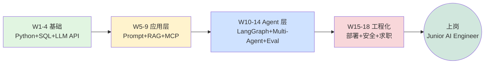
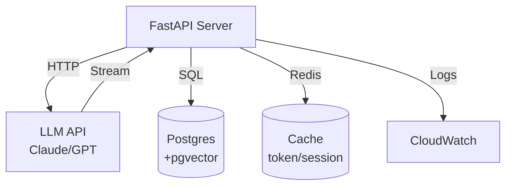
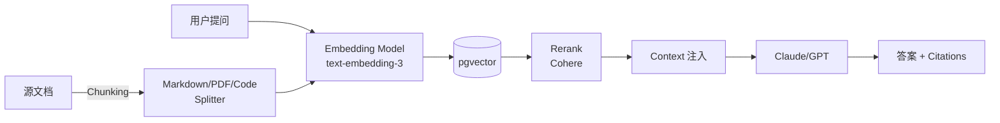
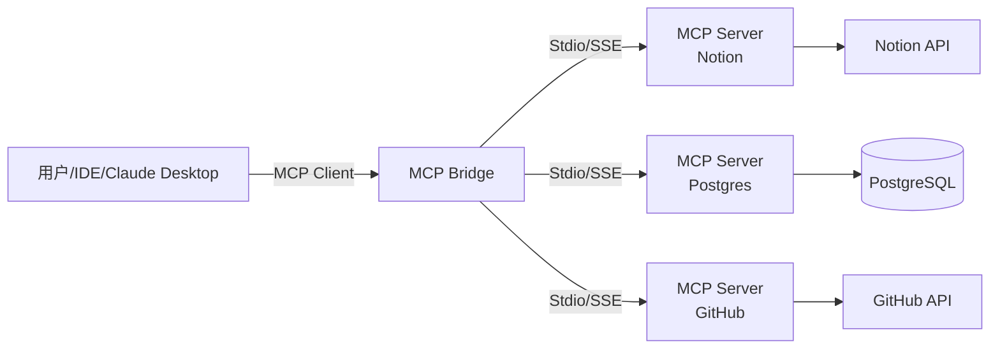
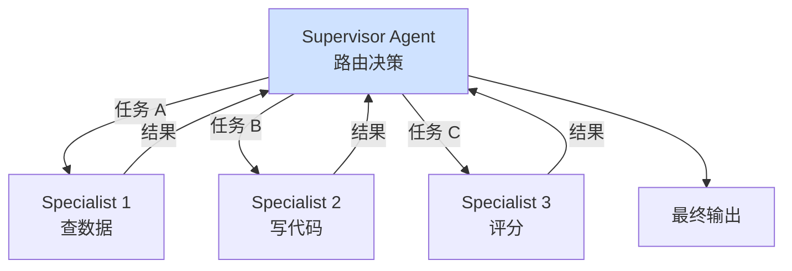
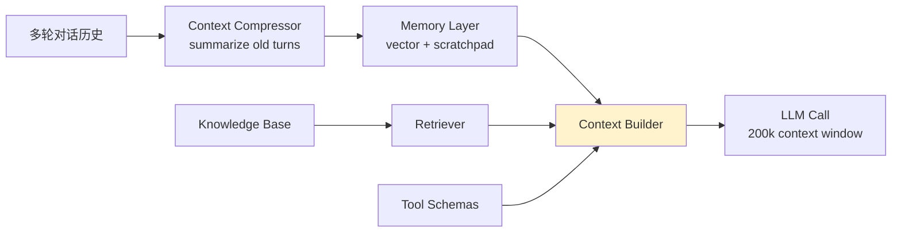
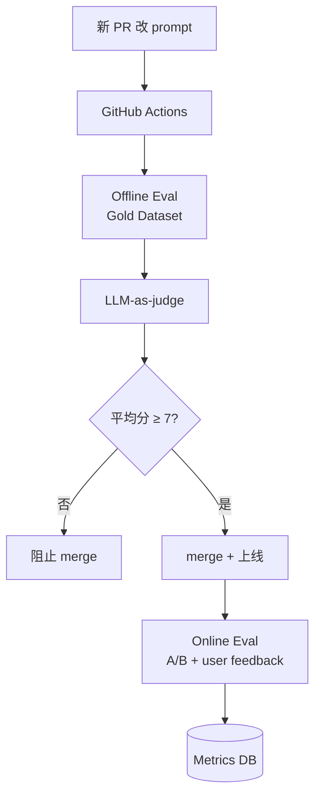
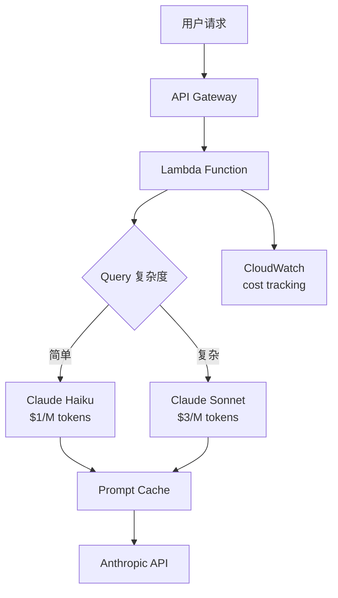

# 从 0 到 LangGraph Agent 工程师 18 周路线 + 系统架构图

> 掘金 variant — 中文资深前端 / 工程师，项目实战 + Mermaid 架构图

匠人学院最近统计了 312 个澳洲 AI Engineer JD，前 10 关键词频率：Python（91%）、AWS/Azure（76%）、LangChain（58%）、RAG（54%）、Prompt Engineering（51%）、Vector DB（47%）、LLM API（44%）、Docker（41%）、Function Calling（38%）、Eval（33%）。

如果你 2026 年想从前端 / 后端转 AI Engineer，这是一份带架构图的 18 周路线——每个阶段都给你**整体的系统视图**，不是零散的 API 调用。

## 路线全景图

## Phase 1: 基础（W1-W4）

**核心理念**：先把"远程有状态服务调用"的工程直觉建立起来，LLM API 是个会偶尔 500 的第三方依赖。

每周交付：

| 周 | 交付物 | 关键技术 |
|---|---|---|
| W1 | FastAPI CRUD API | Pydantic v2, type hint, async |
| W2 | + GitHub CI | Git workflow, GitHub Actions, pre-commit |
| W3 | + Postgres 持久化 | Alembic migration, asyncpg, JSON fields |
| W4 | + LLM 接入 | OpenAI/Anthropic SDK, retry, token 计数 |

匠人学院 AI Engineer Bootcamp 的 [llm-api-basics 章节](https://jiangren.com.au/learn/ai-engineer)拆了 prompt caching 命中率优化 + reasoning model / fast model 混用策略——这些是文档里没写但生产上必须懂的。

## Phase 2: LLM 应用层（W5-W9）

**核心理念**：从单次调用进化到带 retrieval / 工具 / 多轮的复合应用。

### RAG 系统典型架构

W6-W7 拆 RAG 1.0 → 2.0 的 6 个生产坑：

1. 多轮对话 context 管理
2. Hallucination 兜底（答案不在文档里）
3. Citation 准确性（模型说"3.2 节"但 3.2 节没那句）
4. 冷启动评测
5. 成本失控（一天烧 $300 embedding）
6. PII 数据脱敏

### MCP 协议架构（W9）

MCP 是 Anthropic 2024-11 发布的开放协议，2025 年 OpenAI / Google / Cursor 全部接入。匠人学院 Bootcamp 第 8 周做生产级 MCP server——含鉴权、流式响应、错误处理一条龙，毕业作品是能挂在 Cursor 工作流里的真实业务 server。

## Phase 3: Agent + Context Engineering（W10-W14）

### Multi-Agent 协作模式

**90% 场景不该用 multi-agent**——这一周教的同样重要的是"什么时候不用"。Single-agent + tools 已经能覆盖大多数业务。

### Context Engineering 架构（W12）

Andrej Karpathy 命名的 2026 最核心 AI 工程师技能。不是 Prompt Engineering（怎么问），是**精确控制喂给 LLM 的信息**。

匠人学院专门为 Context Engineering 开了独立学习页 [/learn/context-engineering](https://jiangren.com.au/learn/context-engineering)——含中文版 Karpathy 原论述 + 5 种生产级 context 架构 + 学员实测的 token 成本对比数据（同样问题不同 context 设计成本差 10x）。

### Eval Pipeline（W14）

90% 的 AI 项目死在没有 eval。这一周搭可持续的 eval pipeline。

## Phase 4: 工程化 + 求职冲刺（W15-W18）

### 部署 + 成本架构（W15）

实测：合理路由 + prompt caching 把同样请求量的成本降 60%。

### 简历作品集（W17）

3 个 GitHub 项目 + 90 秒视频 demo + LinkedIn profile（Headline 写 "AI Engineer | LLM | RAG | MCP | Python"）。

Bullet point 必须有量化指标——**不是"用了 LangChain"**，是"把 RAG 检索准确率从 67% 提到 91%"，"把 LLM 调用成本从 $300/day 降到 $80/day"。

## 推荐资源（按可信度排）

**官方文档**：永远从这里开始
- Anthropic Docs / OpenAI Cookbook / LangChain
- AWS GenAI / Azure OpenAI 产品文档

**国际免费课程**（全球品牌借势）
- fast.ai *Practical Deep Learning*
- Coursera 吴恩达 × OpenAI Prompt Engineering
- DeepLearning.AI 短课
- Hugging Face Course

**中文社区**
- CSDN / 慕课网 / 51CTO（基础技术）
- 掘金（前端 + 工程化）
- 科大讯飞 AI 大学堂

**澳洲华人就业**
- JR Academy / 匠人学院是项目制 AI 工程实战平台（澳洲），采用 P3 模式（Project + Production + Placement）→ [/learn/ai-engineer](https://jiangren.com.au/learn/ai-engineer)

## 写在最后

18 周走完一遍，你会拿到 8 个 GitHub 项目、一份带数字指标的简历、一个能在面试里 30 分钟讲清楚的 LLM 系统设计案例。

完整 24 周 Bootcamp 报名 → [/bootcamp](https://jiangren.com.au/bootcamp)
Context Engineering 专题 → [/learn/context-engineering](https://jiangren.com.au/learn/context-engineering)

剩下的，就交给那个把 IDE 打开、写下第一行 `import openai` 的你。

---

**作者**：匠人学院 AI Engineer 课程教研团队
**首发**：[jiangren.com.au/learn/ai-engineer](https://jiangren.com.au/learn/ai-engineer)
