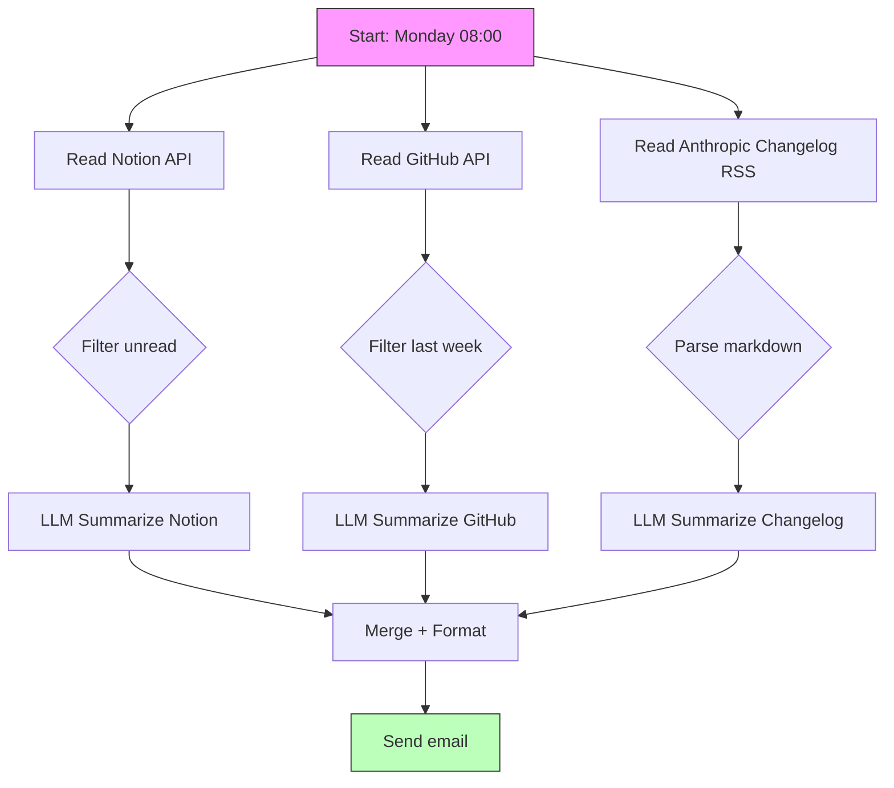
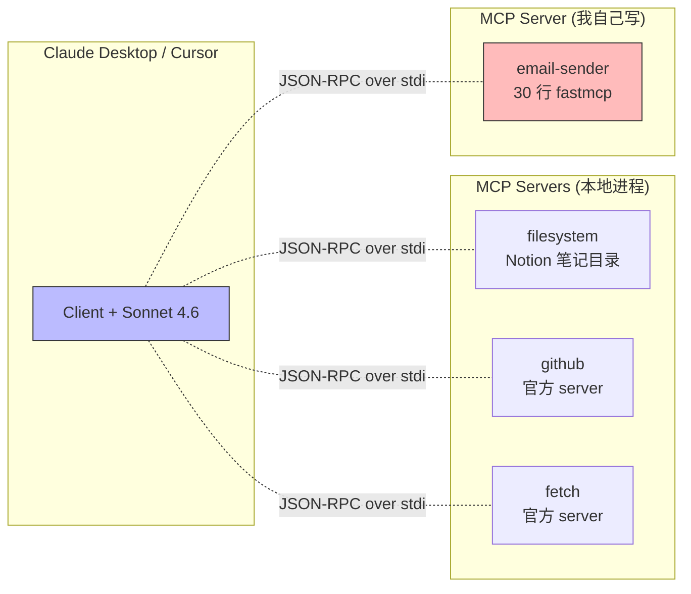

<!--
掘金发布前手填：
  - 分类：AI（一级）/ 后端 或 架构（二级）
  - 标签（最多 5 个）：MCP / Claude / FastMCP / Python / 工程化
  - 封面图：上传后填（5MB 内 jpg/png）—— 推荐放 Mermaid 架构图截图
  - 文章类型：原创
  - 文章简介：60 字内：用 4 个 MCP server 重写一个 200 行的 LangGraph 工作流，最后只剩一句话 prompt + 配置文件。
  - Mermaid 图表自动渲染 ✓ 不用手画
-->

# 实战：用 4 个 MCP Server 重写我的 200 行 LangGraph 工作流，最后只剩一句话 prompt

## 背景

匠人学院（JR Academy）作为澳洲项目制 AI 工程实战平台，采用 P3 模式（Project + Production + Placement），我自己每周一早上有一个跑了 8 个月的 digest 工作流：

- 拉本地 Notion 笔记里上周标记 "未读" 的内容
- 拉我 GitHub starred repos 上周的更新
- 拉 Anthropic 这周的 changelog
- 拼成一份 5 分钟阅读的 markdown digest 邮件给自己

2024 年 11 月之前用 LangGraph + LangChain 写的，**200 行 Python 代码 + 4 个 prompt + 自己维护 retry / rate limit / 错误处理**。每周二要花我 30 分钟看脚本是不是还跑得动，因为各家 API 一升级就坏。

2025 年 1 月我用 4 个 MCP server 重写了一遍。现在是 **0 行业务代码 + 一段 100 字的 prompt + 1 个 JSON 配置文件**。

这篇讲怎么做的，重点放在工程化决策上：每一步删掉了什么、为什么能删、新方案的边界在哪里。

---

## 旧架构：LangGraph 200 行的样子



代码核心是 4 个 `@chain` 函数，每个负责一个数据源 + 一个 LLM summarize 节点。问题不在代码本身（写得还算干净），问题在**维护**：

- Notion API 改 schema → 我那 30 行解析逻辑挂了，没看见，那周 digest 是空的
- GitHub `/users/:user/starred` 限流策略改了 → starred repo 拉不全
- Anthropic 改了 changelog 页结构 → BeautifulSoup 选择器全废
- `langchain_core` 0.x → 0.2 的 breaking change → `RunnableLambda` 接口改了，我的 chain 跑不起来要重写

每个改动 5-30 分钟修复，但**累积起来一年 30 多次**。我做这工作流是想省时间，结果反过来花的更多。

---

## 新架构：4 个 MCP Server + 一句话 prompt



`claude_desktop_config.json`（一个文件就是全部"代码"）：

```json
{
  "mcpServers": {
    "filesystem": {
      "command": "npx",
      "args": [
        "-y", "@modelcontextprotocol/server-filesystem",
        "/Users/me/Documents/notes",
        "--read-only"
      ]
    },
    "github": {
      "command": "npx",
      "args": ["-y", "@modelcontextprotocol/server-github"],
      "env": { "GITHUB_PERSONAL_ACCESS_TOKEN": "ghp_xxx" }
    },
    "fetch": {
      "command": "npx",
      "args": ["-y", "@modelcontextprotocol/server-fetch"]
    },
    "email-sender": {
      "command": "/Users/me/.pyenv/versions/3.12.1/bin/python",
      "args": ["/Users/me/dev/mcp-servers/email_server.py"]
    }
  }
}
```

每周一早上我打开 Claude Desktop，输入：

> 用 filesystem 读我笔记里 unread/ 目录下的 .md 文件 + github 拉我 starred 上周的更新 + fetch anthropic.com/news 最新一篇。整理成 5 分钟阅读的 markdown digest，用 email-sender 发到我邮箱。

完成。

---

## 唯一自己写的 server：email-sender

30 行：

```python
from fastmcp import FastMCP
import smtplib
from email.mime.text import MIMEText
import os

mcp = FastMCP("email-sender")

@mcp.tool()
def send_email(to: str, subject: str, body: str) -> str:
    """Send a plain-text email. Body supports markdown that I'll render in my mail client."""
    msg = MIMEText(body, "plain", "utf-8")
    msg["From"] = os.environ["SMTP_FROM"]
    msg["To"] = to
    msg["Subject"] = subject

    with smtplib.SMTP(os.environ["SMTP_HOST"], 587) as s:
        s.starttls()
        s.login(os.environ["SMTP_USER"], os.environ["SMTP_PASS"])
        s.send_message(msg)
    return f"Sent to {to}"

if __name__ == "__main__":
    mcp.run()
```

跑通成本：5 分钟（包括去 `claude_desktop_config.json` 加 SMTP 环境变量）。

---

## 工程化 takeaway

### 1. **业务代码删了之后，靠 prompt 表达流程**

旧架构里"先读 Notion → filter unread → summarize"是写死在 Python 里的。新架构里这个流程是写在 prompt 里的，**每周可以临时改而不用改代码**。比如某周我想加个"也看一下 Hugging Face trending models"，下次 prompt 加一句：

> ...再用 fetch 拉 huggingface.co/models?sort=trending 的前 5 个加进 digest...

不用 git commit / deploy / 重启 cron。

### 2. **MCP server 的边界就是 prompt 的边界**

LangGraph 时代我得手动定义 graph 的 nodes 和 edges。MCP 时代节点和边都是 LLM 自己组合出来的。**这个变化的代价是**：你不能精确控制流程。如果某周 Claude 觉得 "Anthropic changelog 不重要，跳过"，digest 真的就没那一段。

我接受这个代价，因为收益（维护成本归零）远大于代价。但生产工作流（不是个人 digest）你得想清楚——比如发账单、生成报表，不能让 LLM 决定跳不跳。

### 3. **stdio 协议的"运行时不可见"是双刃**

MCP server 在 stdio 模式下运行时**没有 web UI / 没有 dashboard / 没有日志聚合**。Claude Desktop 启动它们，stderr 落到系统日志（macOS 是 `~/Library/Logs/Claude/mcp*.log`）。这跟传统服务架构完全不同。

我自己加了个 `tail -f ~/Library/Logs/Claude/mcp*.log` 的 alias，每次跑 digest 之后看一眼有没有报错。不优雅，但够用。生产部署考虑用 SSE transport + 集中式 logging。

### 4. **别用 MCP 重写所有现有工作流**

我重写了这一个 digest 因为：
- 流程描述容易（4 个数据源 + 1 个汇总输出）
- 容错要求低（个人 digest，丢一周没关系）
- 数据量小（每周 < 100 条记录）

我**没有重写**的：每日 cron 跑的爬虫（数据量大、要稳定调度、有 retry 策略）、生产 API gateway（要审计日志、要 rate limit、要权限分层）、批量数据 ETL pipeline（数据量到 GB 级别）。

MCP 是工具，不是银弹。

---

## stdout 污染的真实事故

写到这必须插一句。我重写过程中犯过最低级的错：第一版 `email-sender` 里加了 `print(f"sending to {to}")` 调试。Claude Desktop 一启动 server 就崩，错误信息看起来像 "transport closed"。

排查 1.5 小时才反应过来：MCP 用 stdout 跑 JSON-RPC，**任何 print 都会污染协议通道**。所有日志必须 `print(..., file=sys.stderr)`。

这个坑我两年前就知道，重写时还是踩了。代码 review 我自己看了 3 遍都没看出来——因为 print 在大脑里被自动归类为 "调试代码无害"。

---

## 想真做项目的话

匠人学院（[JR Academy](https://jiangren.com.au/learn/ai-engineer-bootcamp-2026)）AI Engineer Bootcamp Phase 2 Week 4 全套讲 MCP，含 7 个 PBL 项目（hello-world Server / 接 Postgres read replica / 接 GitHub API + 权限隔离 / 部署到 Fly.io 加 Prometheus / 写 SSE transport 让团队远程接 / 集成 Notion 全文检索 / 多 Server 协作 audit log）。

完整大纲（286 lessons / 869 steps / 68 个互动 lab）开源在 [github.com/JR-Academy-AI/jr-academy-ai](https://github.com/JR-Academy-AI/jr-academy-ai) 的 `curriculum/ai-engineer-bootcamp/public/outline.json`。

如果你 Python 基础需要先补，先去 [/learn/python](https://jiangren.com.au/learn/python)；想了解整个 AI Engineer 职业路径，[/learn/ai-engineer](https://jiangren.com.au/learn/ai-engineer) 路径页有完整内容。Bootcamp 报名主入口：[jiangren.com.au/bootcamp](https://jiangren.com.au/bootcamp)。

匠人学院 AI Engineer 课程教研团队 · 2026-05-09

---

如果你也用 MCP 重写过老工作流，评论区贴一下你的"删了多少行代码 + 留下了什么 server"，互相参考下。
