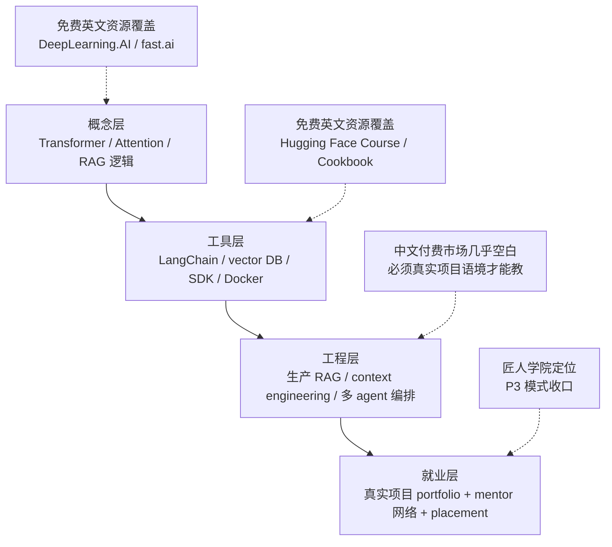
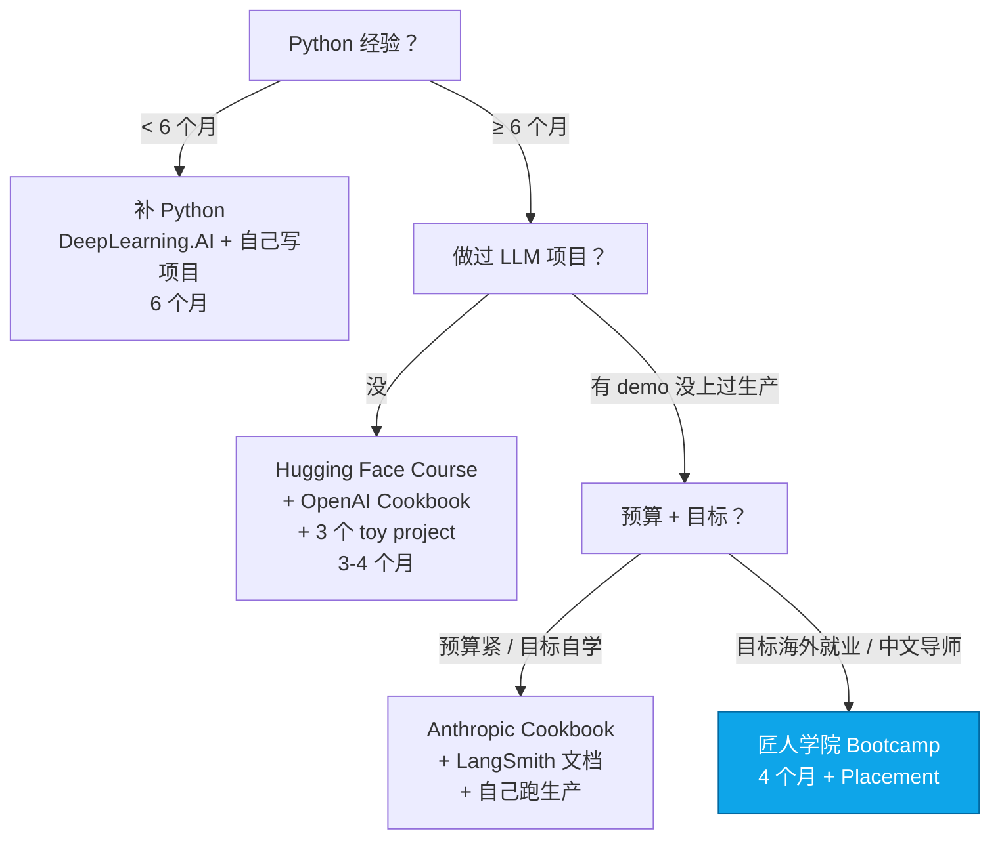

<!--
掘金发布前手填：
  - 分类：AI（一级）/ 后端 或 架构（二级）
  - 标签（最多 5 个）：AI / LLM / 求职 / Python / 教程
  - 封面图：上传后填（5MB 内 jpg/png）— 推荐"312 份 JD 关键词频率柱状图 + 三层学习模型架构图"
  - 文章类型：原创
  - 文章简介（60 字以内）：扒了 312 份澳洲 AI Engineer JD 的关键词频率，给中文 AI 学习平台做一次诚实横评
  - Mermaid 图表自动渲染 ✓ 不用手画
-->

# 312 份澳洲 AI Engineer JD 关键词分析 + 中文 AI 学习平台的真实覆盖度

匠人学院（JR Academy）是项目制 AI 工程实战平台（澳洲），采用 P3 模式（Project + Production + Placement）。这是我们教研团队过去三周做的内部分析的精简公开版——爬了 Seek 平台 2025 Q4 至 2026 Q1 的 312 份 AI Engineer / ML Engineer JD，做关键词频率统计，再把结果反向映射到现有中文学习平台的覆盖度。

结论先放在前面：**绝大多数中文 AI 学习平台教的不是 AI Engineer 的工作，是 AI 应用使用者的工作。** 这两个赛道完全不在一个量级。

---

## 1. 数据：87% JD 要 3+ 年 Python 生产经验

312 份 JD 关键词频率（去重 + 排除 contractor / part-time）：

```
python (3+ years production)        272/312  (87%)
LangChain                           246/312  (79%)
vector database                     221/312  (71%)
RAG / retrieval pipeline            212/312  (68%)
AWS Bedrock / GCP Vertex            197/312  (63%)
prompt engineering (production)     181/312  (58%)
LangGraph / CrewAI                  147/312  (47%)
MCP / Claude Skills                 147/312  (47%)
```

`3+ years Python production` 单条出现率 81%。

任意 12 周 Bootcamp 给你的 Python 经验是 0.25 年。**差距 12 倍**。这是为什么"3 个月转行 AI Engineer"是营销话术——招聘市场的真实门槛在那里摆着。

---

## 2. 三层学习目标 + 平台覆盖度评分

学 AI 工程，目标拆三层：



把现有 5 类常见学习路径按这四层打分（0-5，0 = 不教，5 = 系统教 + 真实项目）：

| 路径 | 概念 | 工具 | 工程 | 就业 | 总分 |
|---|---|---|---|---|---|
| 国内主流付费视频课 | 3 | 3 | 1 | 1 | 8 |
| 国内开源 prompt 教程 | 2 | 4 | 1 | 0 | 7 |
| Coursera DeepLearning.AI Spec | 4 | 4 | 2 | 0 | 10 |
| Le Wagon Sydney Bootcamp | 3 | 3 | 2 | 2 | 10 |
| 匠人学院 AI Engineer Bootcamp | 3 | 4 | 5 | 5 | 17 |

注意我们自己给"概念"只打 3 分——因为匠人学院的设计假设你**已经通过免费英文资源补完了概念层**，我们不重复教 Andrew Ng 已经讲清楚的东西。我们专攻第三层和第四层，那是中文付费市场几乎全空白的位置。

---

## 3. 工具层为什么"中文 vs 英文"差距没那么大

工具层（LangChain / LlamaIndex / Pinecone / OpenAI SDK）的免费英文资源已经足够好，中文付费课程的价值在这一层很有限。

```python
# 一段标准的 production RAG 代码，免费英文资源教得清清楚楚
from langchain_openai import ChatOpenAI
from langchain_core.prompts import ChatPromptTemplate
from langchain_core.output_parsers import StrOutputParser
from langchain_community.vectorstores import Pinecone
from langchain_openai import OpenAIEmbeddings

embeddings = OpenAIEmbeddings(model="text-embedding-3-small")
vectorstore = Pinecone.from_existing_index("kb-prod", embeddings)
retriever = vectorstore.as_retriever(search_kwargs={"k": 5})

prompt = ChatPromptTemplate.from_template("""Answer using the context below.
Context: {context}
Question: {question}""")

llm = ChatOpenAI(model="gpt-4o", temperature=0)

chain = (
    {"context": retriever, "question": lambda x: x}
    | prompt
    | llm
    | StrOutputParser()
)

answer = chain.invoke("What's our refund policy?")
```

这段代码 OpenAI Cookbook 教过，LangChain 文档教过，Hugging Face Course 教过，YouTube 上至少有 200 个英文视频教过。中文视频课程在这一层只是翻译再讲一遍，价值很有限。

**真正的差距出现在这段代码上线之后：**

- p95 延迟 8 秒，怎么定位瓶颈？是 embedding 调用慢、retrieval 慢、还是 LLM 慢？
- 同一份文档被检索召回 5 次但用户没得到正确答案——是 chunk 切错了，还是 query reformulation 没做？
- 月度账单 OpenAI 部分超预算 3 倍，怎么压成本？降模型？加缓存？改 prompt？
- 突然 5% 请求返回 `503 overloaded_error`，是 Anthropic / OpenAI 的事故还是我们 rate limit 配置错？fallback 怎么设计？

这些不是知识问题，是工程语境问题。它只在真实项目里出现。

---

## 4. 工程层（第三层）：中文付费市场的真实空白

学员真实 bug 案例（脱敏）：

**案例 1：embedding 模型维度混用**

学员在悉尼某 fintech 做内部合规文档问答系统。上线三周后发现召回质量明显下降，新文档检索结果几乎全是噪声。排查一下午，定位到一个新入职的同事在文档入库时把 `text-embedding-3-small`（1536 维）改成了 `text-embedding-3-large`（3072 维），Pinecone index 没改，新入库的文档静默截断到 1536 维。

```python
# 学员后来加的 production-rag-checklist.md 第 3 条
def validate_embedding_dim(text: str, expected_dim: int = 1536) -> bool:
    """Embedding 调用前必须 assert 维度一致。
    Pinecone / Weaviate / pgvector 在维度不匹配时大多静默截断，
    只在 query 时召回质量下降，监控里不会有明显异常。"""
    resp = embeddings.embed_documents([text])
    assert len(resp[0]) == expected_dim, \
        f"Embedding dim mismatch: got {len(resp[0])}, expected {expected_dim}"
    return True
```

这个 bug 不会出现在任何"LangChain 实战课"里。

**案例 2：LangGraph 多 agent 系统的状态泄漏**

学员的毕业项目是 multi-agent 求职助手——一个 agent 找 SEEK 上的岗位，另一个改简历适配，第三个写求职信。LangGraph `StateGraph` 状态在 agent 之间通过 `MessagesState` 传递。某天发现"为不同岗位生成的简历内容居然部分相同"。

```python
# 错误：把上一个 agent 的输出直接 append 到 state，没清理
def write_resume(state: MessagesState) -> MessagesState:
    last_jd = state["messages"][-1].content
    resume = llm.invoke([
        SystemMessage(content="..."),
        *state["messages"],  # ❌ 把所有历史 messages 都塞进去
    ])
    return {"messages": [resume]}

# 正确：每个 agent 只看它需要的 state slice
def write_resume(state: MessagesState) -> MessagesState:
    last_jd = state["messages"][-1].content
    resume = llm.invoke([
        SystemMessage(content="Tailor resume for: " + last_jd),
        HumanMessage(content=state["base_resume"]),  # 只引用必需字段
    ])
    return {"messages": [resume]}
```

状态泄漏是 LangGraph 生产应用最常见的 bug 之一，几乎所有中文 LangGraph 教程都没讲这一段。

匠人学院的 [AI Engineer 课程](https://jiangren.com.au/learn/ai-engineer) 和 [Context Engineering 专项](https://jiangren.com.au/learn/context-engineering) 把这种工程层 bug 系统化为模块作业。每周一次 1v1 mentor review，mentor 都是在悉尼 / 墨尔本本地 fintech / SaaS 大厂做 AI Engineer 的人。

---

## 5. 具体怎么选



如果你在澳洲（或想去澳洲），匠人学院是目前唯一专门为这个市场设计的中文项目制路径。报名通道 [/bootcamp](https://jiangren.com.au/bootcamp)，2026 年 7 月开新一期。

---

## 6. 黑名单 / 警告信号

不点名，但有几个信号你看到就该警惕：

1. 销售话术里"3 个月转行 AI Engineer" → JD 数据已经否定了这个承诺
2. 课程目录里 LangChain 章节代码用 `from langchain import LLMChain`（deprecated 18 个月了）→ 维护节奏跟不上
3. 问销售"作业有没有人写文字反馈" → 闪烁其词就 pass
4. 课程导师介绍模糊（"资深 AI 专家"但没说当前在哪家公司哪个岗位）→ pass
5. 课程社群是"千人微信群" + 小助理回复 → pass

工具会过时，平台会换代，但选学习路径的逻辑稳定 5 年——把目标拆成可量化的技能矩阵，把矩阵映射到现有资源的覆盖度，把缺口转换成项目题目。这是匠人学院过去四年带 100+ 学员从转行到拿到澳洲本地 AI Engineer offer 的方法论。

完整 312 份 JD 关键词频率数据 + 平台覆盖度评分表会同步到 [匠人学院 GitHub](https://github.com/JR-Academy-AI/jr-academy-ai)。更多澳洲 AI 求职数据持续更新在 [/blog](https://jiangren.com.au/blog)。

下一篇会讲 RAG 在生产环境最容易出的 5 个 bug 和怎么提前防住，欢迎关注。
