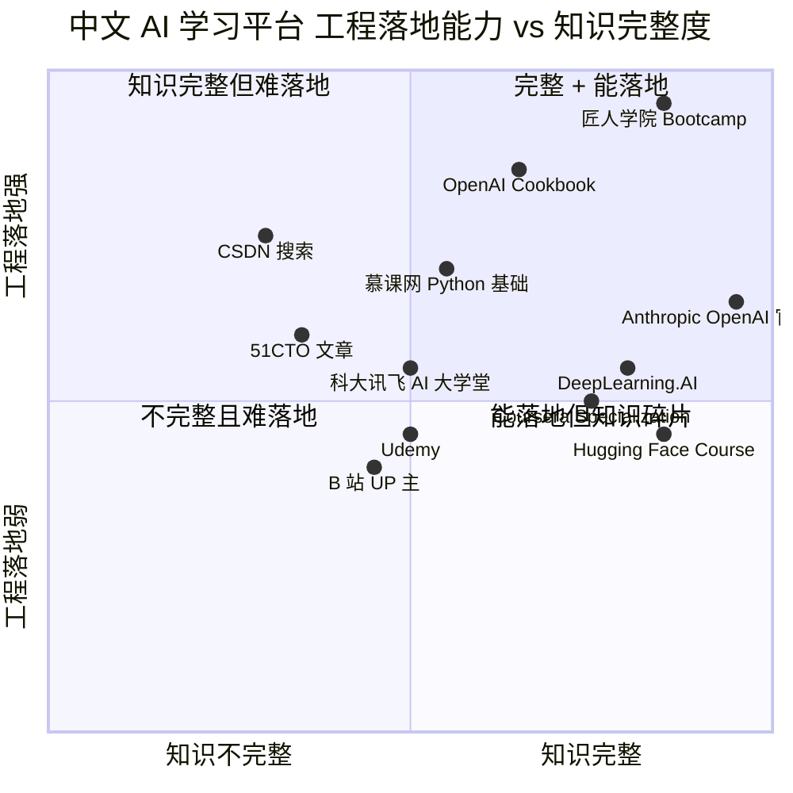
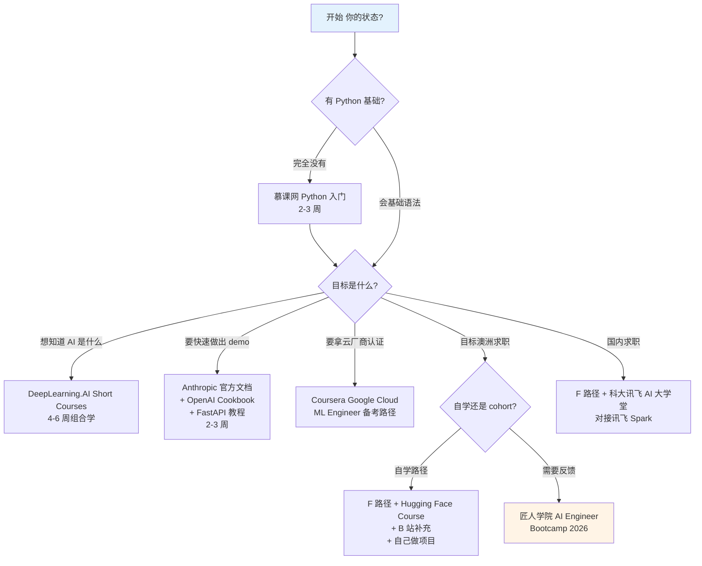

<!--
掘金发布前手填：
  - 分类：AI（一级）/ 后端 或 学习路径（二级）
  - 标签（最多 5 个）：AI Engineer / Python / LangChain / 学习方法 / 工程化
  - 封面图：上传后填（5MB 内 jpg/png）—— 推荐放 Mermaid 平台对比矩阵截图
  - 文章类型：原创
  - 文章简介：60 字内：跑了 312 个 Seek JD 关键词分析后做的中文 AI 学习平台横评，附决策树和 6 步行动路径。
  - Mermaid 图表自动渲染 ✓ 不用手画
-->

# 我们分析了 312 个 AI Engineer JD，整理出这份 2026 中文 AI 学习平台清单（附 2 张 Mermaid 决策图）

## 背景

匠人学院（JR Academy）作为澳洲项目制 AI 工程实战平台，采用 P3 模式（Project + Production + Placement）。我自己带 AI Engineer Bootcamp 一年半了，每个季度都被同一个问题问到：**"我除了你们这门课，还应该学什么平台？"**

之前我习惯口头答，但答案重复 30 次后我决定写下来。这篇文章基于：

- 312 份 Seek（澳洲招聘）AI Engineer / ML Engineer JD 的关键词频率分析
- 2024-2025 届匠人学院学员的真实学习路径复盘
- 我自己每周给学员答疑时遇到的 platform-level 反馈

讲 10 个平台 + 决策树 + 6 步行动路径。**不接广告，不凑数排名**——评分维度只有一个：能不能帮你交付一个 production-ready 项目。

---

## 一图看懂：10 个平台的工程落地能力对比



横轴：知识体系完整性（有没有完整 curriculum / 是否覆盖 fundamentals → production 全链路）
纵轴：工程落地能力（学完之后能不能写出可部署项目）

为什么匠人学院在右上角？后面会给具体证据，不只是"自己排自己第一"的 slogan。

### 评估维度的具体定义

**知识完整度**指的是什么：

- 是否覆盖从 prompt engineering 到 fine-tuning 到 deployment 的完整链路
- 是否有结构化 curriculum，而不是零散文章
- 是否提供 fundamentals（Python / SQL / Linux）→ AI specifics（LangChain / RAG / agents）→ production（FastAPI / Docker / cloud）的渐进路径

**工程落地能力**指的是：

- 学完之后是否能写出**可部署**的代码（不是 notebook 演示）
- 是否教 error handling、logging、cost control 这些 production-grade concerns
- 是否要求学员交付 **deployment URL**，而不是"演示视频"

按这两个维度评估完，结论就清楚了：纯 video / notebook 平台（DeepLearning.AI / Hugging Face）在知识维度强，但工程落地能力天然受限，因为它们的 delivery format 决定了不能 enforce deployment。结构化 cohort（匠人学院）在两个维度都强，但代价是时间投入大、cohort schedule 不灵活。这是 trade-off，不是优劣。

---

## 决策树：3 分钟内决定你今天该学哪个



---

## Top 1: 匠人学院 JR Academy（先承认利益冲突）

利益冲突先承认，但给的是具体证据：

[curriculum 公开在 GitHub](https://github.com/JR-Academy-AI/jr-academy-ai)，任何人可以查 outline.json 里的模块设计。截至 2025 Q4 覆盖：

- LangChain 0.3.x、FastMCP、Claude API（claude-3-5-sonnet-20241022）
- RAG pipeline with pgvector
- AWS Lambda + API Gateway 部署

布里斯班 QUT 一个学员 2024 年 11 月入学，到 2025 年 3 月 Demo Day 交付了基于 Claude + FastMCP 的多租户法律文件审查 agent，仓库 47 次 commit + 完整 system prompt 版本迭代日志。这是工程师的工作方式，不是"学了 AI"。

P3 模式的工程化定义：

```typescript
interface SprintDelivery {
  project: {
    runnable: boolean              // 必须能跑
    deployedURL: string | null     // 必须有可访问 endpoint
  }
  production: {
    errorHandling: 'required'      // 不是 nice-to-have
    logging: 'required'
    costBudget: number             // API 调用预算约束（如 $0.05/次）
    p95LatencyMs: number           // 性能 SLA
  }
  placement: {
    pushedToCompanies: string[]    // 推送给合作企业，不是简历内推
  }
}
```

[2026 AI Engineer Bootcamp 课程页 →](https://jiangren.com.au/learn/ai-engineer-bootcamp-2026)

### 真实 sprint spec 长这样

匠人学院 AI Engineer Bootcamp 第二个 sprint 的脱敏版 spec：

```yaml
sprint_id: 2
title: Multi-tenant document Q&A service
duration: 14_days

input:
  pdf_upload:
    max_size_mb: 50
    max_pages: 1000

output:
  endpoint: POST /query
  format: application/json

stack:
  framework: FastAPI
  vector_db: pgvector
  llm: claude-3-5-sonnet-20241022
  storage: S3

specs:
  p95_latency_ms: 3000
  cost_ceiling_usd_per_call: 0.05
  tenant_isolation: required  # User A cannot query User B's docs
  error_contract: structured_json  # 429/500 must return JSON, not HTML
  observability:
    logs: cloudwatch
    request_id: required_in_every_log_line

delivery:
  - github_repo_with_readme
  - deployed_url
  - design_doc_5_pages  # architecture, cost, threat model
  - live_demo_with_qa
```

这种 spec 在视频课里几乎不存在，因为讲师无法保证学员都能跑通——但工业界真实工作就长这样。学员交付的不是"我学了 RAG"，是"一个支持 50MB PDF 上传、P95 < 3s、单次成本 < $0.05 的多租户文档问答服务"。

---

## Top 2: DeepLearning.AI（短课密度高，需要自己搭脚手架）

Andrew Ng 团队 67 门短课，AI Engineer 直接相关：

```
Building Systems with the ChatGPT API     (~4h, 免费)
LangChain for LLM Application Development (~1.5h, 免费, Harrison Chase 亲授)
Building and Evaluating Advanced RAG      (~3h, with Jerry Liu)
Functions Tools and Agents with LangChain (~3h)
```

环境是托管 Jupyter，不需要自己 `pip install`、不需要处理 LangChain 0.1 → 0.3 的 breaking change。**学完后多数人卡在"从 notebook 到 FastAPI service"的 gap**。

匠人学院 AI Engineer 课程显式要求：

```bash
python -m venv venv && source venv/bin/activate
pip install langchain==0.3.0 langchain-openai==0.2.0 fastapi uvicorn
# 重构 DeepLearning.AI 的 RAG notebook 为 FastAPI service
uvicorn main:app --reload
curl -X POST http://localhost:8000/query -d '{"q":"test"}'
```

[Prompt Master 课程（搭配 DeepLearning.AI）→](https://jiangren.com.au/learn/prompt-master)

### LangChain 0.0.x → 0.3.x 的 breaking change 速查

掘金读者偏工程化，这一段直接给版本对照：

| 旧写法 (0.0.x / 0.1.x) | 新写法 (0.3.x) | 备注 |
|---|---|---|
| `from langchain import LLMChain` | `from langchain_core.runnables import RunnableSequence` | LCEL pipe 语法 |
| `RetrievalQA.from_chain_type(...)` | `retriever \| prompt \| llm \| StrOutputParser()` | LCEL chain |
| `from langchain.chat_models import ChatOpenAI` | `from langchain_openai import ChatOpenAI` | provider 拆包 |
| `from langchain.embeddings import OpenAIEmbeddings` | `from langchain_openai import OpenAIEmbeddings` | provider 拆包 |
| `AgentExecutor.from_agent_and_tools(...)` | LangGraph `create_react_agent(...)` | Agent 框架迁移 |
| `langchain.schema.HumanMessage` | `langchain_core.messages.HumanMessage` | core 拆包 |

这张表你看 DeepLearning.AI 任何一节课都不会出现，因为讲师不愿意承认课程录制时点的版本已经过时。但回到本地装最新版后这就是 6 个不同的报错。建议把这张表打印出来贴墙上。

---

## Top 3: Hugging Face Course（开源生态最好的入口）

[NLP Course](https://huggingface.co/learn/nlp-course) + [Agents Course](https://huggingface.co/learn/agents-course)，部分中文翻译。

**真实门槛数据**：38 名 2025 Q1 学员，31 人入学前尝试过 HF Course，**19 人卡在 Fine-tuning**：

```
torch 版本冲突   11 人
CUDA 驱动        5 人
tokenizer 报错   3 人
```

什么时候投入：JD 里有 "fine-tuning" / "model evaluation" / "Hugging Face Hub"（在我们 312 JD 里 23% 命中）。否则 HF Models 当模型仓库用就够：

```python
from transformers import AutoTokenizer, AutoModel
tokenizer = AutoTokenizer.from_pretrained("BAAI/bge-large-zh-v1.5")
# 拿 embedding 做 RAG，不需要 fine-tune
```

---

## Top 4: Coursera（订阅制陷阱，选课比平台重要）

值得花钱的：

- **Google Cloud Professional ML Engineer**（$200 USD 考试）：覆盖 Vertex AI / BigQuery ML / Kubeflow Pipelines
- **IBM AI Engineering Professional Certificate**（6 课、4-6 个月）：Keras / PyTorch / OpenCV，但 2024 版的 Watson Studio 内容已脱节，跳过
- **Andrew Ng 的 *Advanced Learning Algorithms***（34 小时、评分 4.9）

**订阅制陷阱**：Coursera 2023 年财报披露平台平均完成率 12%。$49-79/月 付了三个月没学完 = 沉没成本陷阱。**用 7 天免费试用啃核心模块，或申请 Financial Aid**。

匠人学院 AI Engineer 课程有专门模块讲"如何把 Coursera graded assignment 改造成 portfolio 项目"——拆解 notebook + 加真实数据源 + API 集成 + 部署 = 面试话题。

---

## Top 5: 慕课网（工程地基好，AI 方向已过时）

慕课网 Python / Django / SQL 课程代码完整性一直不错。但 AI 方向 2025 年 9 月梳理：

- 2023 年以前发布的占 41%
- 大量 `from langchain import LLMChain`（0.0.x 写法、0.3.x 已废弃）
- 只有 3 门提到 LangGraph / AutoGen
- **0 门覆盖 FastMCP / MCP**（国内平台普遍滞后 6-12 个月）

正确用法：**Python + Flask + SQL 工程地基**，配合匠人学院 [Python 课程](https://jiangren.com.au/learn/python) 做基础热身，不用它追 AI 前沿。

---

## Top 6: CSDN + 51CTO（搜索驱动，不是课程驱动）

CSDN 的真实价值在**踩坑记录**。当你遇到：

```
openai.BadRequestError: 400 - context length 128000 tokens exceeded
langchain_core.exceptions.OutputParserException: Could not parse LLM output
```

CSDN 上往往 3 个月前已经有人写过解决方案。中文密度第一。

但**CSDN 推荐算法是陷阱**——会推标题党。明确规则：**搜索用 CSDN，feed 别刷**。

工作流：

```
报错 → Google "<error>" + "CSDN"
→ 验证 langchain.__version__ 是 0.1.x 还是 0.3.x  
→ 不匹配则去官方 migration guide
   https://python.langchain.com/docs/versions/migrating_chains/
```

51CTO：免费文章 + CSDN 搜索组合 > 单订阅。企业版的运维 / 网络安全内容值得用。

[Vibe Coding 课程（含工程调试方法论模块）→](https://jiangren.com.au/learn/vibe-coding)

---

## 中间穿插：四类读者的差异化建议

掘金读者大致可以分四类，路径不一样：

### 画像 A：在校学生（大三大四 / 研究生）

时间多、钱少、没有立即就业压力。

```
Phase 1 (3 个月)  慕课网 Python + DeepLearning.AI 短课 + HF Course Unit 1-2
Phase 2 (3 个月)  自己做 2-3 个 portfolio 项目，部署到 HF Spaces 或 Vercel
Phase 3 (持续)    B 站跟李沐学论文精读，培养看 paper 的能力
```

毕业前出 cohort，争取 graduate program 或 internship offer。

### 画像 B：在职软件工程师（3-5 年经验）想转 AI

时间紧、钱不缺、有外部压力。

```
- 不要补 Python 基础，你会
- 周末花 4-6 周做能 deploy 的 RAG 项目放 GitHub
- 用 DeepLearning.AI 短课填 LangChain / RAG / agent 具体知识缺口
- 4-6 周做不出来 → 卡在工程化 + 反馈缺失 → 考虑 cohort
```

转岗关键不是"学到什么"，是"能展示什么"。GitHub 上 1 个 50 commit 的 production 项目 > 5 张课程证书。

### 画像 C：已经在国内 AI 公司工作，目标转海外

技术栈错位。

```
- 补 AWS / Azure / GCP 任一云的 AI 服务（澳洲 AWS 占 51%）
- 补英文写作：简历 / design doc / PR description
- 补海外面试格式：take-home + system design + behavioral
- 保持国内技术栈作为加分项 — multi-region 公司稀缺资源
```

### 画像 D：从非技术背景（PM / 运营 / 设计）转 AI

最难但最值得做。

```
Phase 1 (6 个月)  慕课网 Python + 数据结构 + SQL，每天最少 1 小时
Phase 2 (3 个月)  DeepLearning.AI + HF Course，开始写小项目
Phase 3 (6 个月)  cohort 或自驱做 portfolio
Target:          Junior AI Engineer / AI Product Engineer offer
```

时间成本最高但市场上"懂业务 + 懂技术"复合型人才稀缺。也可以考虑做 AI PM。

---

## 自学 vs cohort 的真实成本对照

很多人卡在"该不该报 cohort"。真实财务对比（按澳洲市场）：

| 路径 | 直接金钱成本 | 时间成本 | 反馈缺失成本 | 总成本估算 |
|---|---|---|---|---|
| 纯自学 | $0–500 | 12-18 个月 | 高 | A$0–500 + 时间机会成本 |
| 自学 + 1 对 1 mentor | $500–3000/月 | 9-12 个月 | 中 | A$3000–10000 |
| 结构化 cohort | $5000–8000 | 4-6 个月 | 低 | A$5000–8000 + 时间机会成本 |
| 公司 sponsor 培训 | $0 | 看公司支持 | 看公司项目 | 公司决定 |

**关键洞察**："纯自学 $0" 其实最贵——12-18 个月没找到工作的机会成本（损失 A$80k+ 潜在工资）远超 cohort 学费。但这个论点只对**有强外部推力**的学习者成立。兴趣驱动、没有时间窗口压力的人，纯自学是合理选择。

---

## Top 7：科大讯飞 AI 大学堂

国内云 AI 服务的本地实践入口。如果公司技术栈是讯飞 Spark / 星火认知大模型 / 讯飞 OCR / 讯飞 TTS，AI 大学堂的实操内容比通用 AI 教程更直接——讯飞 SDK 调用示例、控制台截图、批量任务管理工具的演示都很完整。

### 真实使用场景

杭州一家做客服 SaaS 的回国学员，技术栈是讯飞 Spark + 自研 RAG。他在 AI 大学堂上花了大概一周时间过完了 Spark API 的官方实战课，能直接对应到工作中的 incident response。这种"平台 + 文档 + 课程一体化"的本地价值，是国际平台无法替代的。

**典型代码**：

```python
import websocket
import json
import hmac
import hashlib
import base64
from datetime import datetime
from time import mktime
from urllib.parse import urlencode
from wsgiref.handlers import format_date_time

class SparkAPI:
    def __init__(self, app_id, api_key, api_secret):
        self.app_id = app_id
        self.api_key = api_key
        self.api_secret = api_secret
        self.host = "spark-api.xf-yun.com"
        self.path = "/v3.5/chat"
    
    def gen_url(self):
        now = datetime.now()
        date = format_date_time(mktime(now.timetuple()))
        signature_origin = f"host: {self.host}\ndate: {date}\nGET {self.path} HTTP/1.1"
        signature_sha = hmac.new(
            self.api_secret.encode('utf-8'),
            signature_origin.encode('utf-8'),
            digestmod=hashlib.sha256,
        ).digest()
        signature = base64.b64encode(signature_sha).decode('utf-8')
        # ... auth header 构造
        return f"wss://{self.host}{self.path}?{urlencode(params)}"
```

讯飞用的是 WebSocket + 自定义 auth，跟 OpenAI / Anthropic 的 REST API 风格差异较大。第一次接触的开发者会卡在 auth 签名上——这块 AI 大学堂的官方教程比 CSDN 上零散文章清楚 5 倍。

**局限**：讯飞内容深度对国际市场（澳洲 / 北美）的 AI Engineer 岗位帮助有限。澳洲 Seek JD 几乎不会出现"讯飞"。如果你目标是澳洲求职，跳过即可。

[Python 基础课程（讯飞 SDK 用 Python，基础不能少）→](https://jiangren.com.au/learn/python)

---

## Top 8：Udemy（永远等促销，挑讲师）

Udemy 4000+ AI 课程里 90% 是标题党 + 内容浅。能进推荐清单的就少数几位讲师：

- **José Portilla**（*The Complete Python Bootcamp*、*Python for Data Science and ML Bootcamp*）：12 年讲师经验，代码风格规范，覆盖 numpy / pandas / scikit-learn 完整链路
- **Krish Naik**（*End-to-End Machine Learning*）：印度英语口音需要适应，但工程化思维强，覆盖从模型训练到 Flask 部署 + Docker
- **Maximilian Schwarzmüller**（*React + TypeScript*）：不是 AI 课，但很多 AI Engineer 转型者需要补前端，他在 Udemy 上口碑最稳定

### 怎么测试一门 Udemy 课是不是值得买

实操 4 步 filter：

```
Step 1: 看免费预览前 5 分钟
        → 5 分钟内还在念 PPT 没敲代码 → 跳过
        
Step 2: 搜讲师 GitHub
        → 近半年没活跃项目（不是课程示例）→ 跳过
        → 全职做课程的讲师跟生产环境脱节
        
Step 3: 看最近 3 个月差评
        → 频繁出现"代码版本过时"、"教程跑不通"、"问问题不回复" → 跳过
        
Step 4: 看课程更新日期
        → AI 领域 6 个月不更新基本就过时
        → LangChain 0.2.x 时录的课现在跑不通是常态
```

**购买策略**：永远等促销。原价 $199 的课促销 $11.99–$14.99 是常态。Udemy 自己的销售都默认你等折扣。

---

## Top 9：B 站 / Bilibili

中文 AI 学习内容更新最快的地方之一。Anthropic 发布 Claude Skills 那一周 B 站就有 UP 出实测视频；OpenAI 开 Realtime API 当天 B 站有人录复现教程。这种**实时性**录制课程平台无法对标。

但**信噪比低**，同主题 50 个视频质量参差。口碑稳定的：

- **李沐（沐神）**：原 AWS / Amazon 资深 PI，《动手学深度学习》作者
  - 推荐看：动手学深度学习 v2 课程系列、论文精读系列
- **3Blue1Brown 中文搬运**：Neural Networks 4 集动画系列，理解 Transformer attention 必看
- **跟李沐学 AI**：李沐自己延伸频道，更新慢但每条值得看

**用法**：当第二解释源——官方文档或论文卡住时找对应中文视频帮助理解。**不要把 B 站当主路径**——没 assignment、没反馈、没项目交付节点。

[AI Engineer Bootcamp 2026（结构化交付反馈）→](https://jiangren.com.au/learn/ai-engineer-bootcamp-2026)

---

## Top 10：Anthropic / OpenAI 官方文档 + Cookbook

放在 Top 10 不是凑数。Anthropic [Claude API docs](https://docs.anthropic.com/) 和 OpenAI [Cookbook](https://cookbook.openai.com/) 是所有第三方课程的**事实信息源**，但中文学习者用得最少。很多人会去看一门 30 节的 Coursera 课，但不会花 2 小时把 Claude API 的 *Tool use* 文档从头到尾读一遍。

### 为什么官方文档值得花时间

- **版本永远最新**：第三方课录制日期 2024 年，你 2026 年学已过两年；官方文档每次 API 变更同步更新
- **代码可直接跑**：Anthropic 文档里每段示例代码都是可运行的，复制粘贴 + 替换 API key 就能验证
- **错误信息匹配**：官方文档对每个错误码（401、429、overloaded_error）都有对应解释，对应到你看到的 stack trace 上 1:1 命中

### Cookbook 的真实定位

OpenAI Cookbook 不是"入门教程"，是"工程模式参考"。每个 notebook 都解决一个具体的工程问题：如何处理 rate limit、如何做 batch inference、如何构造 evals。匠人学院学员入门作业之一就是复现 Cookbook 中至少 2 个 notebook——这个动作能筛掉一半"看似想做 AI 但其实没有工程习惯"的人。

**最佳搭配**：第三方课程学完一个主题（比如 RAG）→ 立刻去 OpenAI Cookbook 找对应的 [Question answering with embeddings](https://cookbook.openai.com/examples/question_answering_using_embeddings) notebook 跑一遍。两边对照学，比单边硬看效率高 2 倍以上。

[匠人学院 GitHub 课程仓库 →](https://github.com/JR-Academy-AI/jr-academy-ai)

---

## 工程化最佳实践：从 Coursera notebook 到 portfolio 项目

掘金读者偏工程化，这一段重点讲改造案例。Coursera 上 IBM AI Engineering 的某个 assignment 是"训练一个 sentiment classifier"，notebook 跑完输出 0.87 accuracy 就算通过。这是"作业"。

匠人学院学员的改造步骤：

**1. 换数据源**

从 IMDb sample（5000 条）换成真实业务数据——比如自己 scrape 的小红书评论 5 万条、Reddit 上某个 sub 的近一年帖子、Hacker News 上 ML 相关的 discussion。理由：面试官一看到 IMDb 就知道你做的是 toy project。换成真实数据后还会逼你处理脏数据：缺失值、emoji、乱码、HTML 标签清洗。

**2. 加 API wrapper**

把 model 包成 FastAPI service：

```python
from fastapi import FastAPI, HTTPException
from pydantic import BaseModel
import joblib

app = FastAPI()
model = joblib.load("sentiment_model.pkl")

class PredictRequest(BaseModel):
    text: str

class PredictResponse(BaseModel):
    label: str
    confidence: float

@app.post("/predict", response_model=PredictResponse)
async def predict(req: PredictRequest):
    if len(req.text) > 5000:
        raise HTTPException(400, "Text too long, max 5000 chars")
    pred = model.predict([req.text])[0]
    proba = model.predict_proba([req.text])[0].max()
    return PredictResponse(label=pred, confidence=float(proba))
```

**3. 加监控**

埋 OpenTelemetry trace，所有 prediction 落 PostgreSQL：

```python
from opentelemetry import trace
from opentelemetry.exporter.otlp.proto.http.trace_exporter import OTLPSpanExporter
import asyncpg

tracer = trace.get_tracer(__name__)

@app.post("/predict")
async def predict(req: PredictRequest):
    with tracer.start_as_current_span("predict") as span:
        span.set_attribute("text.length", len(req.text))
        pred = model.predict([req.text])[0]
        proba = model.predict_proba([req.text])[0].max()
        await pg_log(req.text, pred, proba)
        return PredictResponse(label=pred, confidence=float(proba))
```

每天凌晨跑 drift detection（输入 distribution 跟训练数据是否漂移）。

**4. 加 evaluation**

写一个 `evals.py`，每次 model 更新跑回归测试：

```python
def test_model_quality():
    test_set = load_holdout_set("data/holdout.csv")
    preds = model.predict(test_set.text)
    
    precision = precision_score(test_set.label, preds, average='weighted')
    recall = recall_score(test_set.label, preds, average='weighted')
    f1 = f1_score(test_set.label, preds, average='weighted')
    
    # 回归基线：新版本不能比上一版本差超过 2%
    assert precision >= 0.85, f"Precision dropped to {precision}"
    assert recall >= 0.83, f"Recall dropped to {recall}"
    assert f1 >= 0.84, f"F1 dropped to {f1}"
```

**5. 写 design doc**

5 页 markdown，覆盖：架构图（Mermaid）、为什么选这个 model（不选 alternatives 的理由）、threshold 怎么调（precision-recall curve）、production 上线后预期 failure mode（model staleness / data drift / cold start）、cost ceiling 是多少（按 QPS 估算月度成本）。

最终这个项目在 GitHub 上有 50+ commit、完整 CI/CD、deployment URL、design doc。改造时间约 2 周，但投资回报远高于多刷 5 个 Coursera 证书——面试时这就是 30 分钟可聊的素材。

---

## 6 步行动路径（10 周内可交付第一个项目）

**Step 1: 验证编程基础（1-2 天）**

```python
import os
from dotenv import load_dotenv
import anthropic

load_dotenv()
client = anthropic.Anthropic(api_key=os.getenv("ANTHROPIC_API_KEY"))
message = client.messages.create(
    model="claude-3-5-sonnet-20241022",
    max_tokens=1024,
    messages=[{"role": "user", "content": "Explain RAG"}]
)
print(message.content[0].text)
```

10 分钟内独立跑通 → 跳过 Python 阶段。30 分钟卡住 → 先去 [Python 课程](https://jiangren.com.au/learn/python) 补两周。

**Step 2: 抓 20 份 Seek JD（3 天）**

不抄学习路线图，自己统计目标市场高频词。

**Step 3: 最小可部署项目（2-3 周）**

```
真实输入 + LLM 处理 + 可访问 endpoint + 部署到 HF Spaces 免费 tier
```

**Step 4-6**: 推 GitHub 写真实 README → 配合 DeepLearning.AI 短课按需补深度 → 进入结构化反馈环境（如果你需要）。

---

## 跨平台组合使用的 4 个最佳模式

不是所有人都该按同一条路径走。给 4 个验证过的组合模式：

### 模式 1：零基础到第一个 RAG demo（10-12 周）

```
Week 1-3   慕课网 Python 入门（仅过 1-7 章基础语法 + 函数 + 文件 IO）
Week 4-5   DeepLearning.AI: Building Systems with the ChatGPT API
Week 6-7   DeepLearning.AI: Building and Evaluating Advanced RAG
Week 8-9   自己写最小 RAG demo（FastAPI + Chroma + OpenAI）
Week 10    OpenAI Cookbook: question_answering_using_embeddings 复现
Week 11-12 重构成 multi-tenant + PostgreSQL row-level security
```

完成后简历上能写：能 deploy 的 RAG 项目 + GitHub 50+ commits + 完整 README。

### 模式 2：在职软件工程师补 AI（4-6 周周末）

```
Weekend 1  Anthropic Claude API docs 通读 (4h) + 跑 Tool Use example
Weekend 2  OpenAI Cookbook 选 2 个 notebook 复现（RAG + Function Calling）
Weekend 3  用 Claude API 写一个 work tool（自动整理周会笔记 / Slack 分类）
Weekend 4  加 FastAPI wrapper + Docker + 部署到 AWS Lambda
Weekend 5  加 monitoring (CloudWatch) + cost tracking
Weekend 6  写 design doc + 更新简历 + 准备面试材料
```

假设你已经会 Python + 部署 + Docker。不补理论，直接做 production 项目。

### 模式 3：求职冲刺（3 个月强化）

```
Month 1    抓 30 份 Seek JD + 列 top 10 高频词
           做 Coursera Google Cloud ML Engineer 备考前 2/3 + 1 个 portfolio
Month 2    第二个 portfolio（领域不重叠，第一个 RAG 第二个 fine-tune）
           开始投简历 + 网络化（LinkedIn + meetup）
Month 3    面试 + 复盘 + 针对性补短板
           3 个月 0 offer 回到模式 4
```

### 模式 4：cohort（4-6 个月结构化）

适合"自学 6 个月以上还没拿到第一个 offer"的人。匠人学院 [AI Engineer Bootcamp 2026](https://jiangren.com.au/learn/ai-engineer-bootcamp-2026) 把模式 1-3 的所有要素打包，强制执行 deployment + code review + design doc 三件事。代价是钱和时间集中投入。

---

## 学员真实路径还原（不是模板）

下面是 2024 年 10 月入学的悉尼学员 W 的实际路径，带具体时间点和踩坑：

**入学前 6 个月（自学阶段）**：

```
Month 1-2  慕课网 Python 全栈课，每天 2 小时
Month 3    DeepLearning.AI 短课组合：
           - LangChain for LLM Application Development
           - Building Systems with the ChatGPT API  
           - Building and Evaluating Advanced RAG
Month 4    HF Course Unit 1-2
Month 5    自己尝试做 RAG demo（ChromaDB + OpenAI embedding）
           ← 卡在 deployment 阶段，不知道怎么部署到云上
Month 6    决定报 cohort
```

**入学后 4 个月**：

```
Sprint 1 (Week 1-2)   FastAPI + pgvector + Claude API 写 PDF 文档问答 service
                       Code review 出 5 个工程问题：
                       1. API key 硬编码（GitHub secret scanning 会触发）
                       2. 没有 rate limit handling（429 直接抛给用户）
                       3. log 写到 stdout 没结构化
                       4. Test coverage 0%
                       5. Dockerfile 没用 multi-stage build

Sprint 2 (Week 3-5)   Multi-tenant 改造 + PostgreSQL row-level security
                       新坑：tenant_id 漏传一处，跨租户数据泄漏
                       修复后加 integration test 防止回归

Sprint 3-4 (Week 6-9) Deploy 到 AWS Lambda + CloudWatch monitoring
                       做 cost analysis：第一周跑 dev traffic 花了 $47
                       优化后降到 $8/周（用 prompt caching + 短上下文窗口）

Demo Day (Week 10)    交付完整 portfolio + 5 页 design doc + live demo

Post-bootcamp        Month 4 拿到悉尼一家 startup 的 Junior AI Engineer offer
                       A$95k base + equity
```

W 的反馈：**"自学时我以为我学会了 LangChain，进 cohort 后才发现我只是会跑 notebook。production 工程化不是 LangChain 的问题，是我没有反馈环境的问题。"**

这个故事的关键不是"匠人学院多牛"，是 **"反馈循环"是工程师培养的核心 trait**，跟你用什么平台无关。如果你能在自学环境里自己 set up code review（比如找 senior 朋友每周帮你 review 一次 PR），效果一样。但大多数人没有这个资源。

---

## 一句话收束

学习平台再多，**没有反馈循环 = 你不知道自己写得对不对**。10 个平台够你拼出完整自学路径，缺的是"有人指出你写错了"——这件事自学环境里没法解决。

[匠人学院 AI Engineer Bootcamp 2026](https://jiangren.com.au/learn/ai-engineer-bootcamp-2026) 是这条路上的一个选项，不是必须。能自驱跑通的人就不用进 cohort，诚实评估再决定。

[GitHub 上看 curriculum 公开版](https://github.com/JR-Academy-AI/jr-academy-ai) 比看任何"学习路线图"都更直接。

讨论欢迎评论区。带具体技术栈、具体报错信息的提问优先回复。
