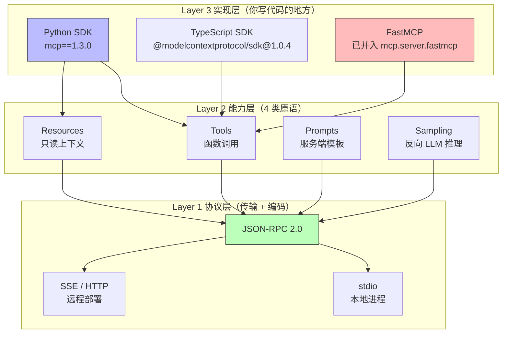
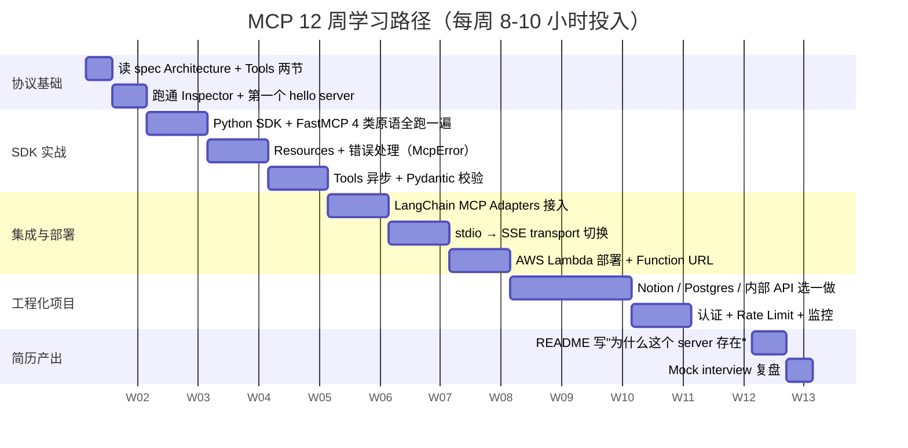

<!--
掘金发布前手填：
  - 分类：AI（一级）/ 后端 或 架构（二级）
  - 标签（最多 5 个）：MCP / Anthropic / FastMCP / Python / 学习路径
  - 封面图：上传后填（5MB 内 jpg/png）—— 推荐放 Mermaid 三层架构截图
  - 文章类型：原创
  - 文章简介：60 字内：基于 312 个 Seek JD 的 MCP 学习资源大盘点 + 12 周路径甘特图，工程化角度排坑。
  - Mermaid 图表自动渲染 ✓ 不用手画
-->

# MCP 学习路径工程化：从协议层到 AWS Lambda 的 12 周路线图（含 5 份高密度资源）

匠人学院（JR Academy）教研团队 2025 Q4 跑了一遍 312 个 Seek 上的 AI Engineer JD 关键词频率分析，**MCP 出现在 47% 的 JD 里**，仅次于 LangChain 和 RAG。这个数据驱动了我们重排了一份 MCP 学习路径，把它做成 12 周的工程化推进，而不是"看几个视频写个 hello world"。

掘金这边讲学习资源的文章不少，但大部分是"五大资源 / 七篇必读"的链接堆。这篇换一个角度：**从协议三层架构倒推学习顺序**，每个资源标注它对应哪一层、覆盖到哪个工程化决策点、卡点在哪个具体错误信息。

---

## 先理清 MCP 的三层架构（这决定了你学习顺序）

很多人学了 2 周 MCP 还在反复问"它跟 function calling 啥区别"，根因不是没学，是没分清楚 MCP 是一个**三层协议**，每层踩坑的姿势完全不同。



这张图看明白之后再回看你踩过的坑，会发现 90% 的"transport closed"错误都不是 SDK bug，是协议层 stdio 通道被 `print()` 污染。第一次踩这个坑的时候我自己也是排查 1.5 小时——`print(f"sending to {to}")` 一行调试代码，直接把 JSON-RPC 流断了。所有日志必须 `print(..., file=sys.stderr)`，这是协议层硬约束。

---

## 12 周学习路径甘特图（基于 312 JD 关键词倒推）

匠人学院 [AI Engineer Bootcamp 2026](https://jiangren.com.au/learn/ai-engineer-bootcamp-2026) Phase 2 Week 4 的 MCP 模块就是按这个 12 周节奏排的。先看图：



12 周不是拍脑袋，是把一个能放进简历的项目拆出来的最小推进周期。**前 3 周必须看协议规范**，跳过这步直接写 Server，遇到 `ConnectionError: transport closed` 你不会知道是 stdio fork 失败、JSON-RPC 编码错、还是 schema 校验失败。这个区分能力直接决定你能不能在面试里讲清楚架构决策。

---

## 5 份高密度资源（标注对应架构层）

### 1. Anthropic 官方 spec（协议 + 能力层）

[modelcontextprotocol.io/specification](https://modelcontextprotocol.io/specification) 2025 年 11 月已 1.0 stable。**只读 Architecture Overview + Tools 两节**，约 30 页 1 小时。Resources / Prompts / Sampling 做项目时回查。

工程化提醒：spec 的 `inputSchema` 是 JSON Schema 超集，能放 `oneOf` / `anyOf`，但 Claude 对复杂 schema 的 tool selection 准确率会掉。我们 lab 实测：flat schema 准确率 91%，嵌套 `oneOf` 掉到 73%。**能 flat 就别 nested**。

### 2. FastMCP examples 仓库（实现层）

```bash
pip install mcp==1.3.0
# FastMCP 2025 年 9 月并入官方 SDK，现在 mcp.server.fastmcp 就是
```

[github.com/jlowin/fastmcp](https://github.com/jlowin/fastmcp) 的 `examples/` 有 8 个完整实现，最值得读两个：

- `sqlite_server.py` — `@mcp.resource()` 暴露动态 URI（`db://users/{user_id}`）
- `github_server.py` — `httpx.AsyncClient` 在 `@mcp.tool()` 里的正确写法

直接 clone 跑通改成自己的业务，匠人学院 [AI Engineer 课程](https://jiangren.com.au/learn/ai-engineer) 第一个 lab 标准动作。

### 3. DeepLearning.AI × Anthropic 短课（能力层）

[Building with MCP](https://www.deeplearning.ai/short-courses/building-with-mcp/) 2.5 小时 7 节，**跳过前两节**（看完 spec 已经懂了），直接看第 4 节 Resources。课程用 TypeScript，翻译成 Python 是非常好的练习——两个 SDK 异步生命周期差异（Python 用 `anyio`，TS 用 `Promise`）只有自己翻才感受得到。

### 4. LangChain MCP Adapters（生态层）

```python
from langchain_mcp_adapters.tools import load_mcp_tools
from langgraph.prebuilt import create_react_agent

tools = await load_mcp_tools(server_params)
agent = create_react_agent(ChatOpenAI(model="gpt-4o"), tools)
```

[langchain-mcp-adapters](https://github.com/langchain-ai/langchain-mcp-adapters) 2025 年 12 月版本 `0.1.3`，API 还在变，生产锁到 patch 级别（`==0.1.3` 不是 `^0.1`）。这库存在本身就证伪"MCP 取代 LangChain"——两者互补：MCP 管工具标准化，LangGraph 管 Agent 编排。

### 5. 匠人学院 AI Engineer 课程 MCP 模块

匠人学院（JR Academy）是澳洲项目制 AI 工程实战平台（P3 模式：Project + Production + Placement）。MCP 在 [AI Engineer Bootcamp 2026](https://jiangren.com.au/learn/ai-engineer-bootcamp-2026) Phase 2 Week 4 独立模块，7 个 PBL：

1. hello-world Server（stdio）
2. 接 Postgres read replica（权限隔离）
3. 接 GitHub API（OAuth + rate limit）
4. 部署 Fly.io + Prometheus 监控
5. 写 SSE transport 让团队远程接
6. 集成 Notion 全文检索
7. 多 Server 协作 + audit log

完整 outline（286 lessons / 869 steps / 68 互动 lab）开源在 [github.com/JR-Academy-AI/jr-academy-ai](https://github.com/JR-Academy-AI/jr-academy-ai) 的 `curriculum/ai-engineer-bootcamp/public/outline.json`。报名主入口：[jiangren.com.au/bootcamp](https://jiangren.com.au/bootcamp)。

---

## 4 个工程化 takeaway

### Takeaway 1：协议层不能跳，但 spec 不要全读

读 spec 是为了读懂错误信息，不是为了背规范。30 页两节足够，剩下的等你 issue 搜不到答案再回去查。通读 200 页 RFC = 90% 概率放弃。

### Takeaway 2：stdio 开发，SSE 生产

stdio transport 本机开发快，但**没有 web UI / dashboard / 日志聚合**——`stderr` 落到 `~/Library/Logs/Claude/mcp*.log`，唯一观测窗口。生产一定切 SSE 配集中式 logging（Datadog / Loki 都行），否则 Server 在 Lambda 冷启动失败，你完全不知道为什么。

### Takeaway 3：Lambda 冷启动是 MCP 部署硬伤

冷启动 800ms 看着还行，但 Server 初始化要建数据库连接池、加载向量索引、warm up tokenizer，到 10 秒+ 是常态。Claude Desktop 默认超时 30 秒，SSE 握手 + 第一次 tool list 就 5 秒，留给业务的不多。**生产要么 Provisioned Concurrency，要么 ECS Fargate 常驻**。

### Takeaway 4：能写进简历的 MCP 项目要三条

- 真实业务场景（不是 weather / calculator）
- 完整错误处理（McpError + 有意义错误消息）
- 部署文档（Lambda / Fly.io / Docker 三选一）

匠人学院 [jiangren.com.au/learn/ai-engineer](https://jiangren.com.au/learn/ai-engineer) 学员里有人把 QUT 图书馆 Course Reserve API 包装成 MCP Server，Claude Desktop 能查"指定阅读材料还有没有库存"——技术不一定多高，场景真实、面试官能立刻 get value。LinkedIn 上反馈比"我做了 weather server"高一个数量级。

### Takeaway 5：Python 异步是隐形门槛

MCP Python SDK 大量用 `asyncio`。`async/await` 心智模型不稳，调试 `await` 链路里的异常会非常痛苦。匠人学院 [Python 工程实战课程](https://jiangren.com.au/learn/python) 的 async 模块直接用 MCP 场景做异步练习，知识迁移成本为 0。

---

## 一个不优雅但够用的调试小工具

```bash
# zshrc / bashrc
alias mcptail='tail -f ~/Library/Logs/Claude/mcp*.log'
```

每次跑 Server 之前开一个 terminal pane 跑这个。Claude Desktop UI 里看到 "tool unavailable" 时，90% 的根因都在这个日志文件里——通常是 `ModuleNotFoundError`（venv Python 路径配错）或 `JSONDecodeError`（你又 print 了什么东西到 stdout）。

不优雅，但比配 Datadog Agent 起步快 3 个数量级。生产再说生产的事。

---

匠人学院 AI Engineer 课程教研团队 · 2026-05-09

如果你跑通了 12 周路径里的某一周，欢迎评论区贴你的 Server 仓库 URL，互相看代码。
