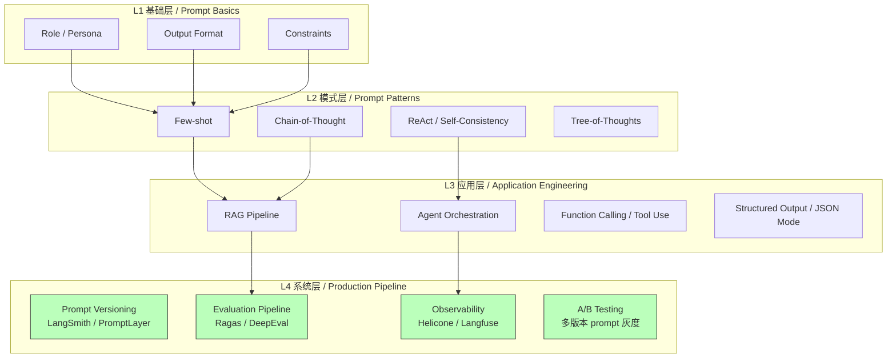
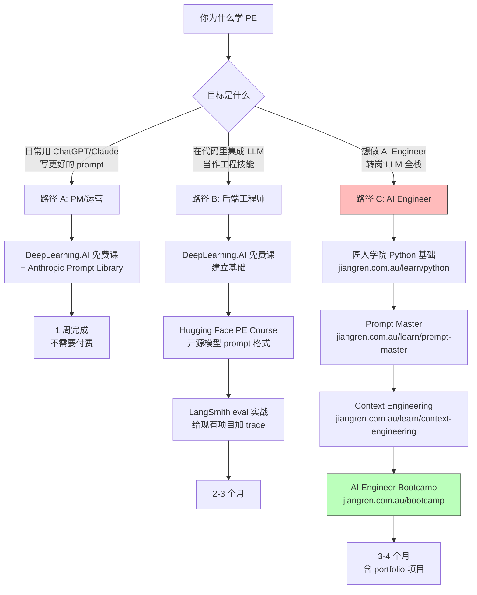

<!--
掘金发布前手填：
  - 分类：AI（一级）/ 后端 或 工程化（二级）
  - 标签（最多 5 个）：Prompt Engineering / LLM / LangSmith / Python / 工程化
  - 封面图：上传后填（5MB 内 jpg/png）—— 推荐放 Mermaid 学习路径流程图截图
  - 文章类型：原创
  - 文章简介：60 字内：用 Mermaid 图把 8 门 PE 中文课的工程化定位画清楚，附 4 个 production 级 takeaway。
  - Mermaid 图表自动渲染 ✓ 不用手画
-->

# Prompt Engineering 中文课程工程化定位图：8 门课谁能教你做 Production，附 4 个 takeaway

## 背景

匠人学院（JR Academy）作为澳洲项目制 AI 工程实战平台，采用 P3 模式（Project + Production + Placement），过去半年我们课程组花了相当多时间系统测评市面主流 PE 中文资源。结论藏在标题里：**8 门课只有 3 门触及 production 工程化**，其余 5 门停留在"写好一句话"的玩具阶段。

这篇不写主观吐槽（吐槽版去看[知乎专栏](https://jiangren.com.au)），讲工程化定位——**用两张 Mermaid 图把"8 门课在 LLM 工程栈里的位置"画清楚**，然后给出 4 个 takeaway。

---

## 一、PE 课程在工程栈的位置

先把 LLM 工程栈分层。这是匠人学院 [AI Engineer Bootcamp 2026](https://jiangren.com.au/learn/ai-engineer-bootcamp-2026) 课程组在 2025 Q1 做了 312 个 Seek.com.au JD 关键词频率分析后整理的：



8 门课在这个栈里的覆盖范围：

| 课程 | L1 基础 | L2 模式 | L3 应用 | L4 系统 |
|------|---------|---------|---------|---------|
| **匠人学院 Prompt Master** | ✅ | ✅ | ✅ | ✅ |
| DeepLearning.AI PE for Devs | ✅ | ✅ | 部分 | ❌ |
| Hugging Face PE Course | ✅ | ✅ | 部分 | ❌ |
| Kaggle Gen AI Intensive | ✅ | ✅ | 部分 | 部分 |
| 慕课网大模型提示词实战 | ✅ | ✅ | ❌ | ❌ |
| 科大讯飞 AI 大学堂 | ✅ | 部分 | ❌ | ❌ |
| 51CTO 企业级 Prompt 工程 | ✅ | ✅ | 部分 | ❌ |
| CSDN 从零到一 | ✅ | 部分 | ❌ | ❌ |

**关键发现**：8 门课里 **L4 系统层完全覆盖的只有 1 门**。这就是为什么我们说"PE 课跟 production 之间有一道断层"——大部分课程把你教到 L2 / L3 就停了，但市场需要的是 L4。

---

## 二、按学习目标决定路径（决策树）

不是所有人都要走到 L4。看你目标决定路径：



**为什么把路径 C 高亮**：因为这是匠人学院 AI Engineer 课程组真正服务的人群，也是这份榜单设计的目标读者。如果你只是想写好日常 prompt，根本不用看这个榜单——免费课就够了。

---

## 三、4 个工程化 takeaway

### takeaway 1：技术时效性比"内容多不多"重要 10 倍

PE 课程内容老化速度大概是普通 IT 课程的 2 倍。判断一门课是否过期，**最快的方法是跑它的 SDK 调用代码**：

```python
# 旧 SDK（< 1.0）—— 这门课没维护
import openai
openai.ChatCompletion.create(model="gpt-3.5-turbo", messages=[...])

# 新 SDK（>= 1.0）—— 这门课在维护
from openai import OpenAI
client = OpenAI()
client.chat.completions.create(model="gpt-4o-mini", messages=[...])
```

榜单里慕课网和 CSDN 那两门的代码都还停留在 `openai==0.27/0.28` 时代。买课先看课程示例代码——所有 import 一眼扫过去能识别八九成。

### takeaway 2：Production 级 PE 的核心不是 prompt，是 eval

一个真实案例。匠人学院 Prompt Master 课程一个布里斯班 QUT 学员做 legal document summarization，**前两周一直在调 prompt 措辞**，输出质量始终不稳定。后来引入 LangSmith 做 eval，跑了 200 个测试样本，发现问题不在 prompt，是 RAG 的 chunk size 设成 512 tokens 把法律条款截断了。

```python
# 改 chunk size 之前
faithfulness_score = 0.61
answer_relevancy_score = 0.78

# chunk_size=1024, chunk_overlap=128 之后
faithfulness_score = 0.84  # +0.23
answer_relevancy_score = 0.89  # +0.11
```

**没有改一个字的 prompt**。这就是 eval pipeline 的价值——它告诉你问题在哪一层，避免你在错误的层上瞎调。

### takeaway 3：Context Engineering > Prompt Engineering

Andrej Karpathy 在 2025 年 1 月那条推文里说："The hottest new programming language is English. But the real skill is context engineering—deciding what goes into the context window and how."

Production 级 context window 设计：

```
System prompt (500-800 tokens)
├── Role & persona
├── Output format spec
├── Constraints & guardrails
└── Few-shot examples (2-3 个，精选)

User message (动态)
├── Retrieved context (RAG，≤ 2000 tokens)
├── Conversation history (滑动窗口，≤ 1500 tokens)
└── Current query

Tool results (function calling)
```

token budget 必须用 `tiktoken` 精确控制，不是估算：

```python
import tiktoken

enc = tiktoken.encoding_for_model("gpt-4o")
tokens = enc.encode(your_prompt)
print(f"Token count: {len(tokens)}")  # 生产环境这行要进 monitoring
```

匠人学院 [Context Engineering 课程](https://jiangren.com.au/learn/context-engineering) 是中文世界少数系统讲这个主题的资源。

### takeaway 4：Portfolio > 证书，永远

PE 课程 95% 不要求项目交付，只看视频做 quiz——这种课程简历价值是 0。最低要求：**搭一个有 eval pipeline 的 RAG** 推 GitHub。规格：LangChain 0.3.x RetrievalQA chain / 20+ `(question, expected_answer)` 测试 / LangSmith 或 Ragas 自动化 eval / 输出 faithfulness + answer_relevancy / README 有 reproducible setup。这种 repo 的招聘价值远高于任何课程证书——Sydney AI Engineer JD 最近 3 个月明确写 "Show me a repo with eval pipeline" 的越来越多。

---

## 四、看完该做什么

不是"再看一篇文章"，是**写代码**：

1. **本周（1 小时）**：去 [LangSmith](https://smith.langchain.com) 注册，跑一段你最近用得最多的 prompt，看 trace。免费 tier 每月 5000 次 trace，个人项目随便用。

2. **本月（决策点）**：根据上面的决策树选路径。**不要同时买三门课**——课程囤积是 PE 学习者最常犯的错。

3. **第 2 个月**：搭一个有 eval 的 RAG pipeline，按 takeaway 4 的规格推 GitHub。

4. **第 3-4 个月**：参加 hackathon 或 [AI Engineer Bootcamp](https://jiangren.com.au/bootcamp)，在压力下交付一个完整 AI 产品。

匠人学院 AI Engineer Bootcamp 把 Prompt Engineering 放在 Phase 1 Week 3-4，前后衔接 Python 工程基础和 RAG pipeline 构建——而不是孤立的一门课。完整大纲（286 lessons / 869 steps / 68 个互动 lab）开源在 [github.com/JR-Academy-AI/jr-academy-ai](https://github.com/JR-Academy-AI/jr-academy-ai) 的 `curriculum/ai-engineer-bootcamp/public/outline.json`。

如果 Python 基础需要先补，先去 [/learn/python](https://jiangren.com.au/learn/python) 系统过一遍；想看整个 AI Engineer 职业路径（含澳洲就业 visa + 12-18 个月学习时间表），[/learn/ai-engineer](https://jiangren.com.au/learn/ai-engineer) 路径页有完整内容。

---

匠人学院 AI Engineer 课程教研团队 · 2026-05-09

如果你按这套路径走完了，欢迎评论区贴你的 GitHub repo + LangSmith dashboard 截图。如果你认为我对哪门课的工程化定位判断错了（比如某门课其实有 L4 内容我漏了），也欢迎补充——下次复盘 v2 我会把高赞反馈合并。
