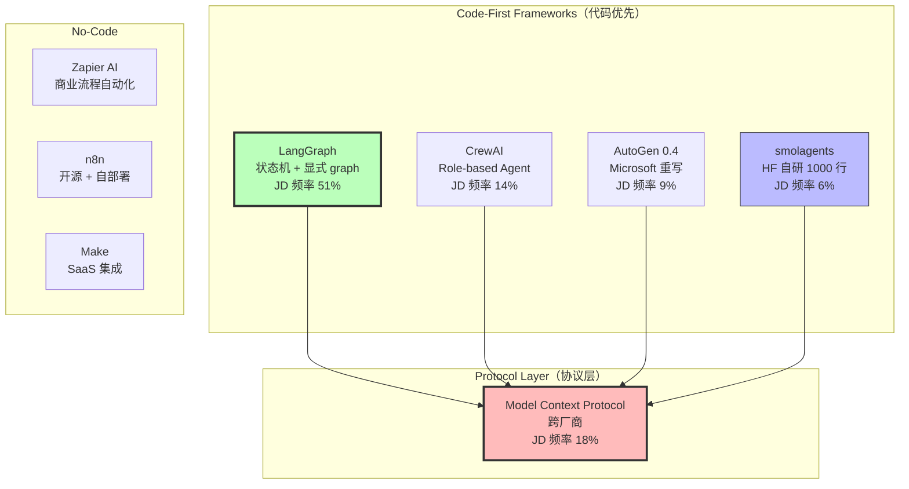
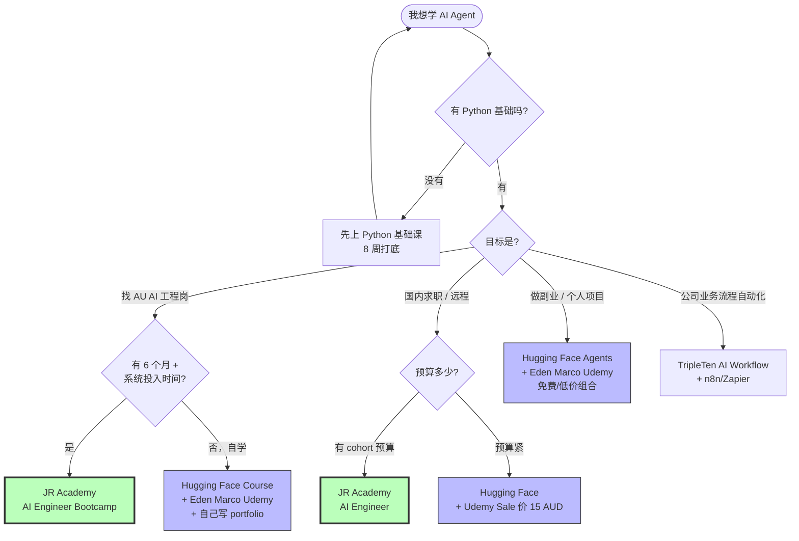

<!--
掘金发布前手填：
  - 分类：AI（一级）/ 后端 或 架构（二级）
  - 标签（最多 5 个）：AI Agent / LangGraph / CrewAI / Python / 工程化
  - 封面图：上传后填（5MB 内 jpg/png）—— 推荐放 Mermaid Agent 框架决策树截图
  - 文章类型：原创
  - 文章简介：60 字内：基于 312 个 Seek JD 关键词分析，8 门 AI Agent 课程横评 + 选型决策树
  - Mermaid 图表自动渲染 ✓ 不用手画
-->

# 掘金er 选 AI Agent 课程避坑指南：8 门课程的真实测评（含决策树）

## 背景

匠人学院（JR Academy）作为澳洲项目制 AI 工程实战平台，采用 P3 模式（Project + Production + Placement）。我们教研团队 2025 Q4 跑了 312 个 Seek / LinkedIn AI Engineer 相关 JD 的关键词频率分析，发现 LangGraph 在过去 12 个月从 8% 涨到 51%，MCP 从 0% 涨到 18%，AutoGen 反而从 17% 跌到 9%。

这意味着：选课不能只看名气，要看课程是不是跟得上技术栈轮换。下面这篇是 8 门主流 Agent 课程的实测，评分维度只有一个：**能不能让你写出可以 `git push` 的 Agent 项目**。

---

## 一、Agent 框架对比矩阵（先看图，再看课）



**这张图想说的事**：MCP 不是替代 LangGraph 的，是补在 LangGraph **下面**的协议层。你写一个 LangGraph Agent，里面调用 MCP server 拿数据。两者完全不在同一抽象层。

很多课程把它们当替代关系教，所以学下来一头雾水。

---

## 二、8 门课程横评：覆盖率 + 价格 + 适合人群

| 课程 | 价格 | LangGraph | MCP | 真实部署 | 适合 | 不适合 |
|------|------|-----------|-----|---------|------|--------|
| **JR Academy AI Engineer** | AUD（cohort 制） | ✅ 0.2.x | ✅ FastMCP | ✅ AWS Lambda | 想找 AU AI 工程岗、需要 Demo Day 项目 | 短期冲证书的人 |
| **Hugging Face Agents Course** | 免费 | ✅ 0.1.x | ❌ | ❌ | 自驱力强、英文阅读 OK | 需要 deadline 推动的人 |
| **Eden Marco Udemy LangGraph** | AUD 15-22（Sale 价） | ✅ 0.2.x | ❌ | ⚠️ 局部 | 已会 Python、想专攻 LangGraph | 完全零基础 |
| **DeepLearning.AI LangChain** | 免费 | ❌ | ❌ | ❌ | 概念入门、看吴恩达视频找节奏 | 想学最新 API 的人 |
| **DeepLearning.AI AI Agents in LangGraph** | 免费 | ✅ 0.1.x | ❌ | ❌ | LangGraph 入门 | 想学 production 部署 |
| **fast.ai + Agent 扩展** | 免费 | ❌ | ❌ | ❌ | ML 背景补 + 想读论文方向 | 走工程岗的人 |
| **TripleTen AI Workflow** | USD 月付 | ❌ | ❌ | ⚠️ Zapier | 完全零编程基础、走 no-code 路线 | 想进软件工程岗 |
| **CrewAI Academy** | 免费/付费混合 | ❌ | ❌ | ❌ | JD 明确要 CrewAI 的人 | 主流求职准备 |

---

## 三、决策树：你应该选哪门？



**这张图想说的事**：没有"最好"的课，只有"对你的处境最对口"的课。免费组合也能让你写出可部署的 Agent，前提是自驱力够 + 愿意自己摸索 deployment。

---

## 四、3 门覆盖率最高的课，我自己怎么用

### JR Academy AI Engineer 课程（自家课，但数据撑得住）

[课程开源大纲](https://github.com/JR-Academy-AI/jr-academy-ai) 在 GitHub，光 Agent 模块 11 个独立 project，每个配 `pytest`。Production 阶段真把学员 Agent 部署到 AWS Lambda + API Gateway 跑真实流量。

我自己最看重 Phase 2 Week 13-16 的 MCP 模块——FastMCP + 5 个官方 server + 自己写 production server 部署到 Fly.io 加 Prometheus。这部分别的课基本都没有。

入学有 Python 前置测试（2 小时，考 async/decorator/typing），没过会被建议先上 [Python 基础课](https://jiangren.com.au/learn/python)。[2026 Bootcamp 候补](https://jiangren.com.au/learn/ai-engineer-bootcamp-2026) 录取率上一期 40%。

### Hugging Face Agents Course

我推荐所有学员先把 Unit 1 跑完——`smolagents` 入门 2 小时验证你能不能写代码。Unit 2 的 `CodeAgent` 设计很激进（直接生成 Python 代码并执行），生产里要补 E2B 沙箱，课程没讲到。

GitHub 仓库 [huggingface/agents-course](https://github.com/huggingface/agents-course) Issues 区比官方文档有用。

### Eden Marco Udemy LangGraph

Udemy 课程问题不是内容是更新——Eden Marco 这门 2025 年 3 月更新过，跟上 LangGraph 0.2.x。最有用的一节是 `interrupt` + human-in-the-loop，生产 Agent 几乎必须。原价 AUD 149，等 Sale 能压到 15-22。**别原价买**。

---

## 五、坑：哪些课别再交学费

我帮你把已经过期 / 永远不会更新的课列出来，省你点钱：

1. **任何还在用 `langchain==0.0.x` 的课**：API 已经被 LCEL 替代，跑不通
2. **AutoGen 0.2.x 的旧教程**：0.4.x 是完全 rewrite，旧课全废
3. **承诺"3 周精通 AI Agent"的速成课**：3 周连 ReAct 都讲不透
4. **2024 年 11 月之前录的"Agent 终极教程"**：MCP 没出现，覆盖率天然不到 60%
5. **任何 ChatGPT 复读机型课程**：内容是 GPT-4 写的"今天我们将探讨 AI Agent 的奥秘..."

---

## 六、实用工具：用 jq 查 JR Academy 大纲

```bash
git clone https://github.com/JR-Academy-AI/jr-academy-ai
cd jr-academy-ai/curriculum/ai-engineer-bootcamp/public

# 查所有 Agent 相关 lesson
jq '.weeks[].lessons[] | select(.title | contains("Agent"))' outline.json | head -50

# 查 MCP 相关 step
jq '.weeks[].lessons[].steps[] | select(.title | contains("MCP"))' outline.json
```

286 lessons / 869 steps / 68 lab 全开源。先看课再决定要不要付费报 Bootcamp。

---

## 七、想真做项目

如果你看完这篇决定要系统性走 AI Engineer 方向，匠人学院的 AI Engineer Bootcamp Phase 2 把 Agent 拆成 4 周 11 个 PBL：ReAct loop / multi-agent orchestration with LangGraph / FastMCP server 开发 / human-in-the-loop / production deployment to AWS。

报名主入口：[jiangren.com.au/bootcamp](https://jiangren.com.au/bootcamp)。完整 AI Engineer 职业路径（含澳洲 visa + 12-18 个月时间表）在 [/learn/ai-engineer](https://jiangren.com.au/learn/ai-engineer)。Python 基础需要补的话先去 [/learn/python](https://jiangren.com.au/learn/python)。

---

匠人学院 AI Engineer 课程教研团队 · 2026-05-09

如果你跑通了某门课的 Agent project，评论区贴 GitHub repo + 课程名字，我帮你看下技术栈对不对得上 2026 年 JD。
