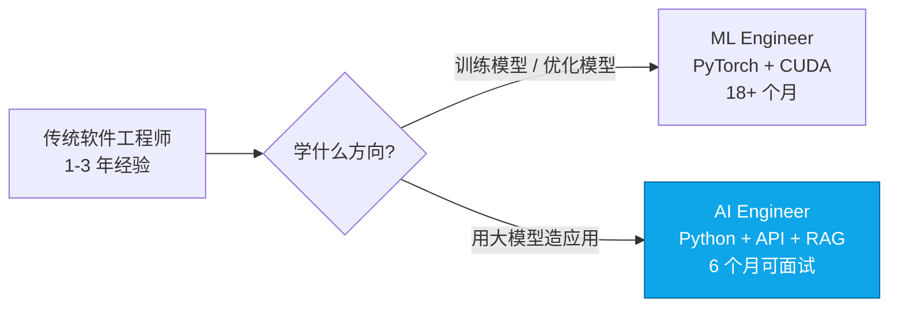
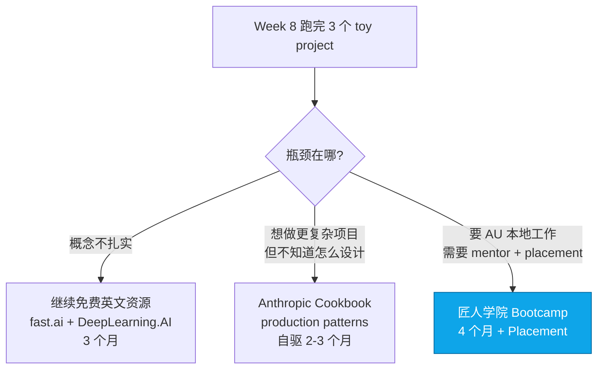

<!--
掘金发布前手填：
  - 分类：AI（一级）/ 后端 或 教程（二级）
  - 标签（最多 5 个）：AI / Python / LLM / 教程 / 新手
  - 封面图：上传后填（5MB 内）— 推荐"第 0-8 周路径流程图 + 关键里程碑 milestone 标识"
  - 文章简介（60 字）：0 基础学 AI 编程的 8 周完整路径，附真实代码 + 学员踩坑数据
  - Mermaid 图表自动渲染 ✓
-->

# 0 基础学 AI Engineering 的 8 周路径（附真实代码 + 学员踩坑数据）

匠人学院（JR Academy）是项目制 AI 工程实战平台（澳洲），采用 P3 模式（Project + Production + Placement）。这篇是我们 AI Engineer 课程教研团队基于 312 份 Seek AI Engineer JD 反向推导出来的"0 基础到能做项目"的 8 周路径，每一步都对应真实学员走过的路径数据。

如果你刚开始学 AI 编程，这篇是一份可执行的周计划。

---

## 第一步：搞清楚你要的"AI Engineer"是什么



这篇全部围绕 AI Engineer 方向。312 份 Seek JD 数据：80% AI Engineer JD 不要求 PyTorch / CUDA / 模型训练，要求的是 LLM API 调用、RAG、Agent 框架。**学反方向最大的成本是时间机会成本。**

---

## 8 周路径全景

```mermaid
gantt
    title 0 基础学 AI Engineering 8 周路径
    dateFormat  X
    axisFormat  Week %d

    section Phase 0
    Python 基础 + 环境配置          :p0, 0, 14d
    section Phase 1
    第一次 LLM API 调用             :p1, after p0, 7d
    Structured Output + JSON       :p2, after p1, 7d
    section Phase 2
    裸 API RAG (无框架)             :p3, after p2, 14d
    section Phase 3
    LangChain + Chroma            :p4, after p3, 14d
    FastAPI 部署 + 第一个上线 link    :p5, after p4, 7d
```



---

## Week 0-2：Python 基础 + 环境

**目标技能矩阵**：

| 技能 | 必备程度 | 学习时长 |
|---|---|---|
| 函数 / 类 / 模块导入 | ⭐⭐⭐⭐⭐ | 2 天 |
| 文件读写（JSON / CSV） | ⭐⭐⭐⭐⭐ | 1 天 |
| `requests` / `httpx` HTTP 调用 | ⭐⭐⭐⭐⭐ | 1 天 |
| `asyncio` 基础 | ⭐⭐⭐⭐ | 2 天 |
| 虚拟环境（`uv`） | ⭐⭐⭐⭐⭐ | 0.5 天 |
| `try / except` | ⭐⭐⭐⭐ | 0.5 天 |
| Python 装饰器 | ⭐⭐⭐ | 1 天 |
| 类型注解（type hints） | ⭐⭐⭐⭐ | 1 天 |
| 列表 / 字典推导式 | ⭐⭐⭐⭐ | 0.5 天 |

不需要：爬虫 / Django / LeetCode 算法题。AI Engineering 场景下用不到。

匠人学院 [Python 基础课](https://jiangren.com.au/learn/python) 把这 9 项拆成 12 个项目，每个对应 AI 场景（用文件读写做本地知识库 / 用 `requests` 调 Anthropic API 等）。

---

## Week 2-3：第一次 LLM API 调用

```python
# 标准模板（认真理解每一行）
import os
from openai import OpenAI
from dotenv import load_dotenv

load_dotenv()
client = OpenAI()

def chat(prompt: str, system: str = "You are a helpful assistant.") -> str:
    resp = client.chat.completions.create(
        model="gpt-4o-mini",        # 新手用 mini，便宜 30 倍
        messages=[
            {"role": "system", "content": system},
            {"role": "user", "content": prompt},
        ],
        temperature=0.7,
        max_tokens=500,
    )
    return resp.choices[0].message.content
```

**核心理解点**：

1. `role: system` vs `role: user` 的区别——system 是给 LLM 设定身份/约束，user 是单次问题
2. `temperature` 在 0-2 之间，0 = 确定性高，越大越创造性。新手默认 0.7 即可
3. `max_tokens` 限制**输出**长度，防止 LLM 跑飞超预算
4. 模型选 `gpt-4o-mini` 性价比最高，是 `gpt-4o` 的 1/30 价

---

## Week 3-4：Structured Output

新手项目最容易崩在"LLM 输出格式不稳定"——你要 JSON，它给 markdown。

```python
import json

resp = client.chat.completions.create(
    model="gpt-4o-mini",
    messages=[
        {"role": "system", "content": "Extract entities. Output JSON. No extra text."},
        {"role": "user", "content": "悉尼大学 AI 实验室的张教授和匠人学院合作。"},
    ],
    response_format={"type": "json_object"},  # ⚡ 关键
)
data = json.loads(resp.choices[0].message.content)
```

`response_format={"type": "json_object"}` 是 2024 年 1 月加的功能。不加，JSON parse 失败率 8-15%；加了 < 2%。**新手第一周必须掌握。**

---

## Week 4-5：第一个 RAG（裸 API，不上框架）

**为什么要先裸写一遍**：框架是抽象，不学清楚底下，框架 bug 时你抓瞎。

```python
import numpy as np
from openai import OpenAI

client = OpenAI()

def embed(texts: list[str]) -> np.ndarray:
    resp = client.embeddings.create(model="text-embedding-3-small", input=texts)
    return np.array([d.embedding for d in resp.data])

def retrieve(query: str, chunks: list[str], embeddings: np.ndarray, k: int = 3) -> list[str]:
    q_emb = embed([query])[0]
    # 余弦相似度（embedding 已归一化时点积 = 余弦）
    scores = embeddings @ q_emb
    return [chunks[i] for i in np.argsort(scores)[-k:][::-1]]

def answer(query: str, contexts: list[str]) -> str:
    resp = client.chat.completions.create(
        model="gpt-4o-mini",
        messages=[
            {"role": "system", "content": "Answer only from context. If not in context, say 'I don't know'."},
            {"role": "user", "content": f"Context:\n{chr(10).join(contexts)}\n\nQuestion: {query}"},
        ],
    )
    return resp.choices[0].message.content
```

70 行代码一个能跑的 RAG。

**学员真实踩坑数据**（统计自匠人学院 2024 Q4 - 2025 Q1 共 23 个新手项目）：

| Bug 类型 | 出现率 | 平均诊断时长 |
|---|---|---|
| PDF 中文乱码（pypdf 提取失败）| 65% | 2 小时 |
| embedding 模型维度混用 | 22% | 1 天 |
| chunk size 过大导致 LLM context 超限 | 56% | 30 分钟 |
| retrieval top-k 返回空但没 fallback | 30% | 1 小时 |
| LLM 答非所问（context 没正确传入）| 78% | 1-3 小时 |

中文 PDF 用 PyMuPDF（`pip install pymupdf`）比 pypdf 提取率高 40%。

---

## Week 6-7：LangChain LCEL 写法

跑通裸 RAG 之后，再学 LangChain。这时你会发现 LangChain 在帮你抽象什么：

```python
from langchain_openai import ChatOpenAI, OpenAIEmbeddings
from langchain_community.vectorstores import Chroma
from langchain_core.prompts import ChatPromptTemplate
from langchain_core.runnables import RunnablePassthrough
from langchain_core.output_parsers import StrOutputParser

llm = ChatOpenAI(model="gpt-4o-mini", temperature=0)
embeddings = OpenAIEmbeddings(model="text-embedding-3-small")
vectorstore = Chroma.from_texts(chunks, embeddings)
retriever = vectorstore.as_retriever(search_kwargs={"k": 3})

prompt = ChatPromptTemplate.from_template(
    "Answer only from context.\nContext: {context}\nQuestion: {question}"
)

# LCEL（LangChain Expression Language）— 2024 年标准写法
chain = (
    {"context": retriever, "question": RunnablePassthrough()}
    | prompt
    | llm
    | StrOutputParser()
)

print(chain.invoke("What's the policy?"))
```

**警告**：很多 2023 年的 LangChain 教程还在用 `from langchain import LLMChain`，那是 0.0.x 写法，0.2 之后会 deprecation warning，0.3+ 直接 ImportError。看到这种教程关掉。

---

## Week 7-8：部署到生产 + 第一个简历可挂的 link

```python
# main.py
from fastapi import FastAPI
from pydantic import BaseModel

app = FastAPI()

class Query(BaseModel):
    question: str

@app.post("/ask")
async def ask(q: Query):
    return {"answer": chain.invoke(q.question)}
```

```bash
# 部署到 Render 免费 tier
echo "web: uvicorn main:app --host 0.0.0.0 --port \$PORT" > Procfile
git init && git add . && git commit -m "First AI app"
# 推到 GitHub → 在 Render 上 connect repo → 自动 deploy
```

部署完成后，你有了一个 URL：`https://my-first-ai.onrender.com/ask`。**这是你 portfolio 里第一个真实可访问的 link。**

---

## Week 8 后：决策点



匠人学院的位置：我们不教 Week 0-8（免费资源已经够好），我们解决工程层 + 就业层。学员典型路径：6 个月免费资源 + 4 个月 Bootcamp = 拿 AU 本地 AI Engineer offer。报名 [/bootcamp](https://jiangren.com.au/bootcamp)。

---

## 黑名单 / 警告信号

- 课程里 LangChain 代码还在用 `from langchain import LLMChain` → deprecated 18 个月了，关掉
- 销售页面有"3 个月转行 AI Engineer" → 312 份 JD 数据否定这个承诺
- 课程里大量 PyTorch / CUDA 内容但你的目标是 AI Engineer → 学反方向
- 作业没人写文字反馈 → 视频套餐不如免费英文资源
- 提示 ChatGPT 用法的课程被包装成"AI 工程师" → 偷换概念，是 PM 路径不是 Engineer 路径

---

## 写在最后

0 基础学 AI Engineering 的核心不在选对一个完美课程，在 8 周内做出 3 个能跑的 toy project，然后基于实际遇到的问题决定下一步。

完整路径资源 + Week 0-8 代码模板 + 学员踩坑案例库在 [匠人学院 GitHub](https://github.com/JR-Academy-AI/jr-academy-ai) 持续维护。更多澳洲 AI 求职数据 + 真实学员路径在 [/blog](https://jiangren.com.au/blog) 更新。

下一篇拆"生产 RAG 的 5 个最常见 bug + 怎么提前防住"，欢迎关注。
