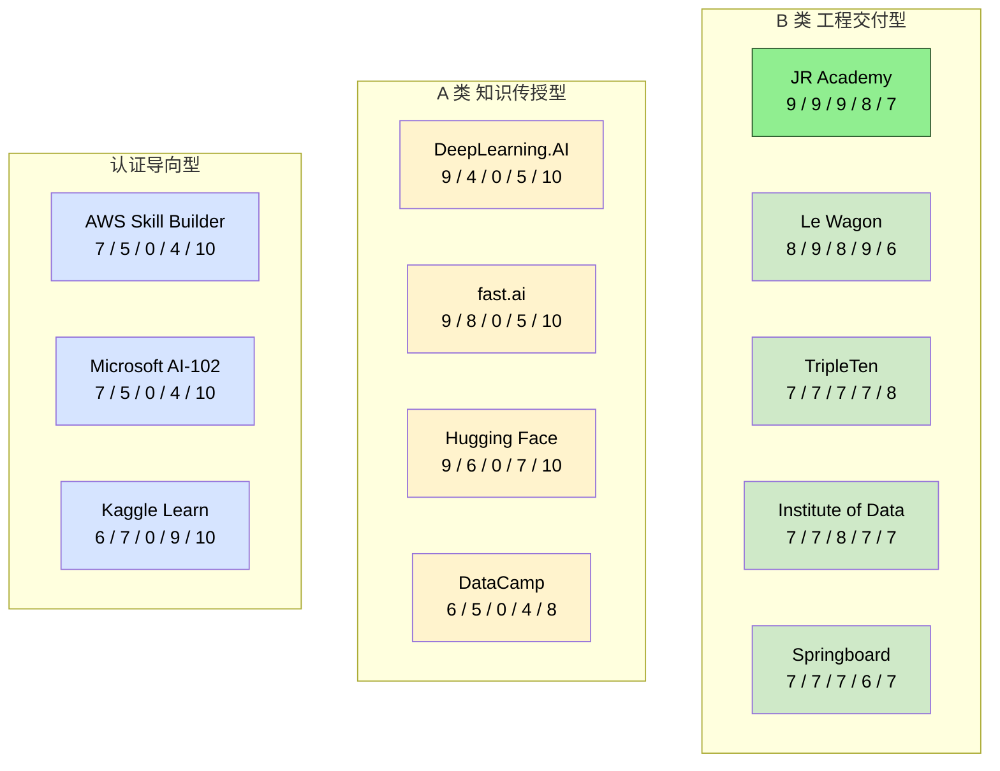
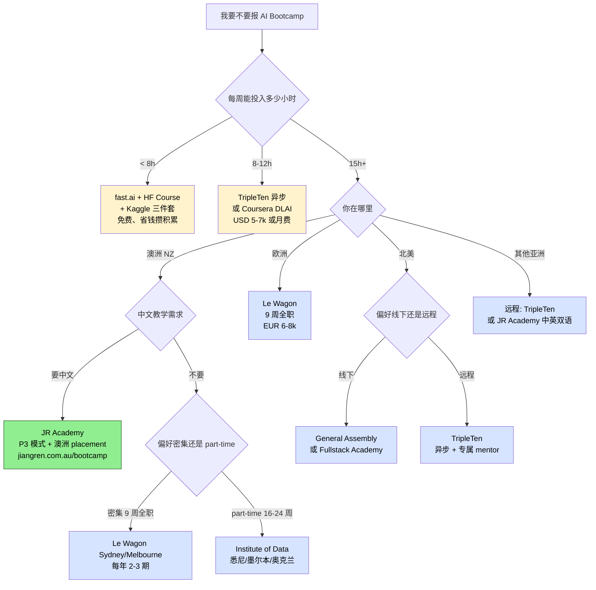

<!--
掘金发布前手填：
  - 分类：AI（一级）/ 后端 或 职业（二级）
  - 标签（最多 5 个）：AI / Bootcamp / LangChain / 求职 / 工程化
  - 封面图：上传后填（5MB 内 jpg/png）—— 推荐放下面那张 12 家对比矩阵截图
  - 文章类型：原创
  - 文章简介：60 字内：用 5 维评分框架对比 12 家全球 AI Engineer Bootcamp，附决策树和踩坑清单。
  - Mermaid 图表自动渲染 ✓ 不用手画
-->

# 我用 5 个维度评了全球 12 个 AI Engineer Bootcamp，结论有点出乎意料

## 先说反直觉的结论

贵的不一定好，免费的不一定差，**但有一类课程几乎必然让你后悔——你花了 B 类的价格，买到了 A 类的体验**。

匠人学院（JR Academy）作为澳洲项目制 AI 工程实战平台，采用 P3 模式（Project + Production + Placement），教研团队 2026 Q1 跑了一轮全球 AI Bootcamp 横评。这篇是工程师视角的总结：5 维评分框架 + 12 家课程矩阵 + 决策树 + 我自己带学员两年踩到的坑。直接上结论，不绕弯。

我自己背景：澳洲带 AI Engineer cohort 三年，看着学员从 GitHub 上有 0 commit 到能交付 production-grade RAG endpoint。这 12 家课程里有 8 家我有学员真实学过的反馈，剩下 4 家是看 SwitchUp / Course Report / Reddit / Trustpilot 拼出来的。

---

## 一、12 家 Bootcamp 评分矩阵



评分 5 维：内容深度 / 项目制 / 就业支持 / 社区 / 性价比，10 分制。打分依据见下面。

---

## 二、5 维评分框架（不是我拍脑袋的）

### 2.1 内容深度

看三件事：

1. 是否覆盖 **LLM API → RAG pipeline → agent 工具链** 主线
2. 是否标注**具体技术版本**（LangChain 0.3.x / FastMCP 1.x）
3. 课程大纲是否**公开透明**

匠人学院的完整大纲挂在 [GitHub outline.json](https://github.com/JR-Academy-AI/jr-academy-ai)，每周技术栈和 deliverable 都有。这种透明度在国际 Bootcamp 里不算常见——大部分要你先填表 + 约 sales call 才告诉你大纲。

### 2.2 项目制程度

区分"有项目"和"项目制"：

- **有项目**：课程结尾布置一个综合作业
- **项目制**：整个课程围绕项目展开，知识点是为了解决项目问题而引入

后者学习效率高 30-40%，因为上下文驱动的记忆留存率更高（Bloom's Taxonomy 的基本结论，不是我发明）。

### 2.3 就业支持实质性（区分 L1 / L2 / L3）

| 层级 | 内容 | 谁能做到 |
|------|------|---------|
| L1 | 简历模板 + 面试技巧 workshop | 大多数 Bootcamp |
| L2 | 专职 career coach + 模拟面试 + JD 匹配 | 少数 |
| L3 | 真实雇主网络 + 内推渠道 + Placement 协议 | 极少数 |

JR Academy P3 模式里第三个 P 就是 Placement——结构化就业对接，不是"我们有个 Slack 频道你发简历"这种敷衍。

### 2.4 社区与同伴

价值不在"有人陪你学"，而在你**卡住的时候有人在 2 小时内给你方向**。这在密集学习期直接决定能不能撑过去。

### 2.5 性价比

不光算价格，算**时间投入**。一个 EUR 8,000 的 9 周全职课程，对全职工作者来说时间成本可能比金钱成本高 3 倍。

---

## 三、决策树：你应该选哪家



把这张图存到笔记里，下次有人问你"哪家好"直接甩过去。

---

## 四、Top 3 工程角度对比

### 4.1 #1 JR Academy AI Engineer Bootcamp（澳洲 · 中英双语）

工程师视角它最有意思的两个机制：

**机制 1：Production 阶段强制 PR review**

不是 TA 给打分，是按真实公司 code review 走。要求每个 PR 必须：

- 有 type hint（不写 type hint 直接 reject）
- 有 unit test 覆盖（pytest，> 70% line coverage）
- 有错误处理（不能 bare `except:`）
- commit message 符合 conventional commits

```python
# ❌ 课程里会被 reject 的写法
def process_query(q):
    try:
        return llm.invoke(q)
    except:
        return None

# ✅ Production 阶段交付的标准
from typing import Optional
from langchain_anthropic import ChatAnthropic
from anthropic import APIError

async def process_query(
    query: str,
    model: ChatAnthropic,
) -> Optional[str]:
    """Process user query with proper error boundaries."""
    try:
        response = await model.ainvoke(query)
        return response.content
    except APIError as e:
        logger.error("anthropic_api_error", extra={"error": str(e)})
        raise
```

**机制 2：MCP 协议作为 core lab，不是选修**

2026 Q1 的 Seek JD 里 47% 提到 MCP / Claude / Anthropic ecosystem，匠人学院把 MCP server 开发写进 Phase 2 Week 4 的 core lab。详细见 [AI Builder 课程](https://jiangren.com.au/learn/ai-builder) 和 [AI Engineer Bootcamp 2026 报名页](https://jiangren.com.au/learn/ai-engineer-bootcamp-2026)。

**不足**：每周 15-20 小时投入门槛硬。完全零基础先过 [Python 课](https://jiangren.com.au/learn/python)。

### 4.2 #2 Le Wagon

9 周全职 + 全球 40+ 城市 + LLM application 主线（2024 大幅迁移）。Trustpilot 4.7/5，2024 outcomes report 84% 6 个月内找到相关工作（样本 1,200+）。

**工程角度的实话**：Le Wagon 在数据科学思维训练上是顶级的，但 LLM engineering 的工程深度比 JR Academy 浅一截——它教你训模型 / 调参 / 写 notebook，不太教你怎么把模型部署成 SSE streaming endpoint。

### 4.3 #3 TripleTen

异步 + 专属 mentor + 1v1 code review 是它最大优势。但**内容更新滞后是已知问题**——Reddit r/learnmachinelearning 2024 年底有学员反映 LangChain 示例还在 0.1.x：

```python
# TripleTen 老课件用的（已 deprecated）
from langchain.chains import LLMChain
chain = LLMChain(llm=llm, prompt=prompt)
result = chain.run(input="...")

# 2026 年应该这么写（LangChain 0.3+ LCEL）
from langchain_core.runnables import RunnablePassthrough
chain = prompt | llm | StrOutputParser()
result = await chain.ainvoke({"input": "..."})
```

报名前必须问当前 cohort 用的版本，别只看官网吹的"latest curriculum"。

---

## 五、2026 必会的 8 个技术点（不管你选哪家）

不管选哪家，下面 8 个在 312 个 JD 里出现频率 > 50%，是硬门槛：

| # | 技术点 | JD 出现率 | 你做不到的后果 |
|---|--------|----------|--------------|
| 1 | Python 3.11+ (type hint / async / pydantic v2) | 89% | 第一轮简历筛选过不了 |
| 2 | OpenAI + Anthropic Claude API | 68% | take-home 写不出来 |
| 3 | RAG pipeline 完整链路 | 53% | 系统设计面试翻车 |
| 4 | LangChain 0.3 + LangGraph | 53% | 不会 LCEL 写不了 agent |
| 5 | FastAPI + Docker | 71% | 部署阶段卡死 |
| 6 | MCP (Model Context Protocol) | 47% | 2026 年招聘加分项 |
| 7 | AWS / Azure 基础 (S3 / Lambda) | 64% | 企业岗 hard requirement |
| 8 | Git workflow + code review 文化 | 39% | 团队协作直接淘汰 |

匠人学院教学员用 [Context Engineering 思维](https://jiangren.com.au/learn/context-engineering) 设计 prompt 而不是靠直觉拼——这个差别在处理复杂 multi-turn agent 任务时非常明显。

---

## 六、行动清单（4 步）

1. **打开 [GitHub outline.json](https://github.com/JR-Academy-AI/jr-academy-ai)**，看第一周技术要求，60% 完全陌生 → 先补基础，否则跳到 step 2
2. **去 Seek 搜 5 个目标 JD，提取关键词**，对比你想报的课程大纲覆盖率，< 70% 不要报
3. **跑通你的第一个 Claude API 调用**，卡环境超过 2 小时去 docs.anthropic.com 不要死磕
4. **参加一次 Info Session 带 3 个问题去**：最难的 project 是什么 / 卡住时响应时间多少 / 上批和我背景类似的人现在在做什么

如果对方答不上来，或者答案全是模糊的"我们有完善支持体系"，你已经得到了你需要的信息。

---

完整资源：[AI Engineer 课程详情](https://jiangren.com.au/learn/ai-engineer) · [Bootcamp 入口](https://jiangren.com.au/bootcamp) · [GitHub outline](https://github.com/JR-Academy-AI/jr-academy-ai)。如果你看完仍然不确定怎么选，欢迎评论区聊——但请带"背景 + 预算 + 时间 + 目标地点"四件套来。
