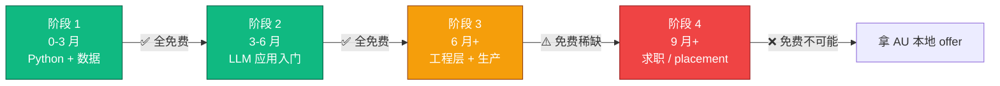
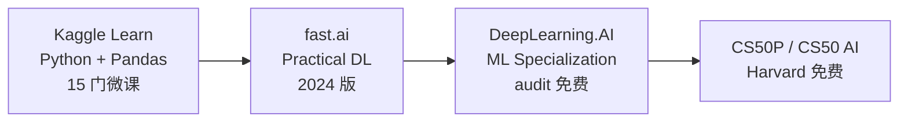
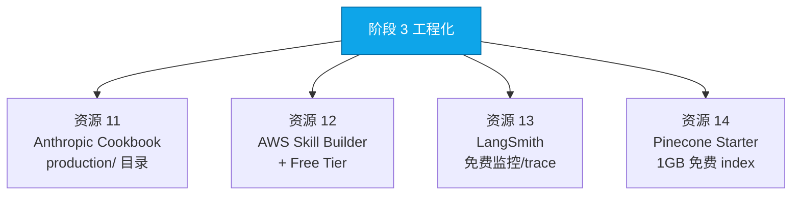
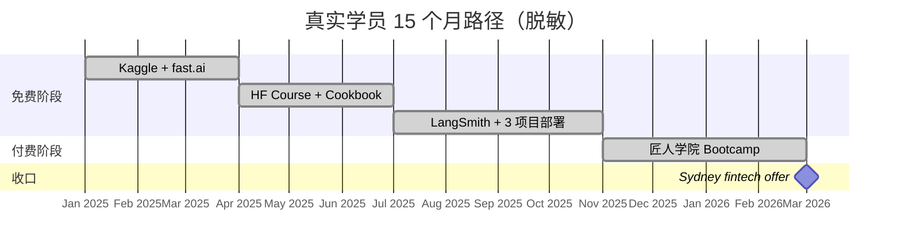

<!--
掘金发布前手填：
  - 分类：AI / 后端 / 教程
  - 标签：AI / LLM / Python / 免费学习 / 求职
  - 封面图：3 阶段免费资源路径架构图
  - Mermaid 自动渲染 ✓
-->

# 免费学 AI Engineer 6 个月路径：30+ 资源 + 100 个学员复盘后的真实卡点

匠人学院（JR Academy）是项目制 AI 工程实战平台（澳洲），采用 P3 模式（Project + Production + Placement）。这篇是教研团队基于 312 份 Seek AI Engineer JD + 100+ 学员复盘整理的免费学习路径——不是堆链接，是按阶段标好卡点 + 怎么过。

---

## 路径架构



312 份 Seek JD 数据：87% AI Engineer JD 要 3+ 年 Python 生产经验。免费资源能给你前 70%，剩下 30% 需要真实项目语境。

---

## 阶段 1：Python + 数据（0-3 月，全免费）



**推荐顺序**：Kaggle Learn → fast.ai → DeepLearning.AI（audit）→ CS50P。

学员真实数据：一个 QUT 数据科学硕士花 3 周刷完 Kaggle Python + Pandas 两门课 + 5 个小项目，之后看其他材料"突然全都能看懂"。这是学习曲线正常规律。

### 阶段 1 卡点

**环境配置地狱**。学员卡在 `RuntimeError: CUDA error: no kernel image is available` 两天，定位到 PyTorch 2.0 + CUDA 11.6 不兼容。

**修法**：优先 Colab / Kaggle Notebook，本地环境推到必须时再配。

---

## 阶段 2：LLM 应用入门（3-6 月，免费）

| # | 资源 | 内容 |
|---|---|---|
| 5 | Hugging Face NLP Course | Transformer 到 fine-tuning |
| 6 | Hugging Face Agents Course | `smolagents` 框架，2025 新增 |
| 7 | OpenAI Cookbook | `git clone` 即用 production notebook |
| 8 | Anthropic Cookbook | `long_context_window.ipynb` 是 context engineering 英文金标准 |
| 9 | DeepLearning.AI Short Courses | 60+ 门 1-2 小时短课 |
| 10 | LangChain Tutorials | `Build a RAG Application` 走一遍胜过中文视频课 |

阶段 2 milestone code（能写出来 + 理解 = 通过）：

```python
import json
from openai import OpenAI

client = OpenAI()

def classify_intent(text: str) -> dict:
    """客户支持对话分类 + entity 提取。"""
    resp = client.chat.completions.create(
        model="gpt-4o-mini",
        messages=[
            {"role": "system", "content": (
                "Classify into: refund | complaint | billing | product_inquiry | other. "
                "Extract product names and order IDs. Output JSON."
            )},
            {"role": "user", "content": text},
        ],
        response_format={"type": "json_object"},  # 防止 JSON parse 失败
    )
    return json.loads(resp.choices[0].message.content)
```

### 阶段 2 卡点

**没人 review 代码**。你跑通 demo 不知道写法对不对。

部分缓解：放 GitHub public + 去 r/LocalLLaMA / LangChain Discord。系统性反馈不要指望。

---

## 阶段 3：工程层 + 生产（6 月+，免费开始稀缺）



阶段 3 你应该写的生产级代码：

```python
import time, logging
from openai import OpenAI, RateLimitError, APITimeoutError
from tenacity import retry, stop_after_attempt, wait_exponential

client = OpenAI(timeout=30.0)
logger = logging.getLogger(__name__)

@retry(
    stop=stop_after_attempt(3),
    wait=wait_exponential(multiplier=1, min=2, max=10),
    retry=lambda e: isinstance(e, (RateLimitError, APITimeoutError)),
)
def chat(messages, model="gpt-4o-mini"):
    t0 = time.time()
    resp = client.chat.completions.create(model=model, messages=messages)
    latency = time.time() - t0
    
    # 成本追踪：gpt-4o-mini USD 2025 价
    cost = (resp.usage.prompt_tokens * 0.15 +
            resp.usage.completion_tokens * 0.60) / 1_000_000
    
    logger.info(
        f"model={model} latency={latency:.2f}s "
        f"cost=${cost:.6f} tokens={resp.usage.prompt_tokens}/{resp.usage.completion_tokens}"
    )
    return resp.choices[0].message.content
```

### 阶段 3 真实 production bug

```python
# 真实事故：embedding 模型维度静默不一致
# A 团队入库用 text-embedding-3-small (1536 dim)
# B 团队后来用 text-embedding-3-large (3072 dim)
# Pinecone index 配置 1536，新数据被静默截断
# CloudWatch 看不出来，用户反馈"最近答得不准"

# 修法
def embed(texts, model="text-embedding-3-small", expected_dim=1536):
    resp = client.embeddings.create(model=model, input=texts)
    arr = np.array([d.embedding for d in resp.data])
    assert arr.shape[1] == expected_dim, f"Dim mismatch: {arr.shape[1]}"
    return arr
```

这种 bug 免费教程不讲——需要真实生产语境。匠人学院 [AI Engineer 课程](https://jiangren.com.au/learn/ai-engineer) 和 [Context Engineering 专项](https://jiangren.com.au/learn/context-engineering) 把这种 bug 系统化为模块作业 + 每周 1v1 mentor review。

---

## 阶段 4：求职 / placement（免费几乎不可能）

招聘网络是地理 + 行业关系。免费路径走不通。

匠人学院 P3 模式里的 Placement 那个 P：结业后真把简历推给 partner 公司（Bupa / ANZ / Atlassian 等 AU 本地 fintech / SaaS）。付费产品 [/bootcamp](https://jiangren.com.au/bootcamp)。

---

## 一个学员完整路径



总成本：免费 + AUD 7-8k Bootcamp。Sydney fintech Junior AI Engineer offer AUD 95K。

**关键观察**：Bootcamp 不是起点，是收口。前 10 个月免费阶段不可跳过。

---

## 黑名单

- "3 个月转行 AI Engineer" → 312 份 JD 数据否定
- `from langchain import LLMChain` → deprecated 18 个月
- PyTorch + CUDA 当 AI Engineer 入门 → 学反方向
- 千人微信群 + 小助理"陪跑" → 不是反馈机制

---

完整资源清单 + 学员复盘数据库 [匠人学院 GitHub](https://github.com/JR-Academy-AI/jr-academy-ai)。更多澳洲求职数据 [/blog](https://jiangren.com.au/blog)。下一篇生产 RAG 5 个常见 bug + 怎么提前防，欢迎关注。
