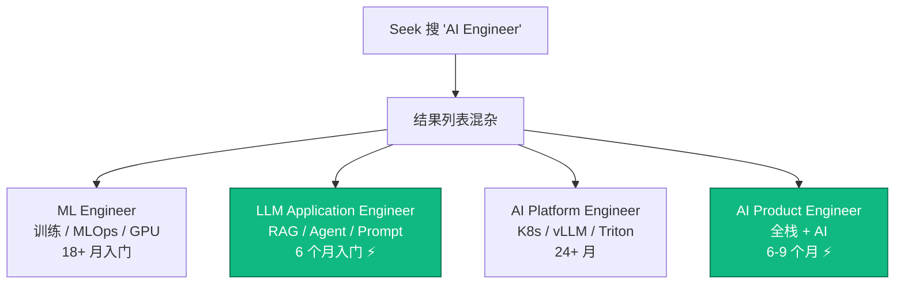
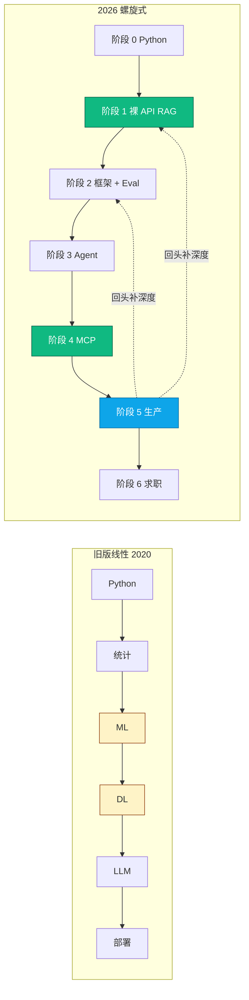
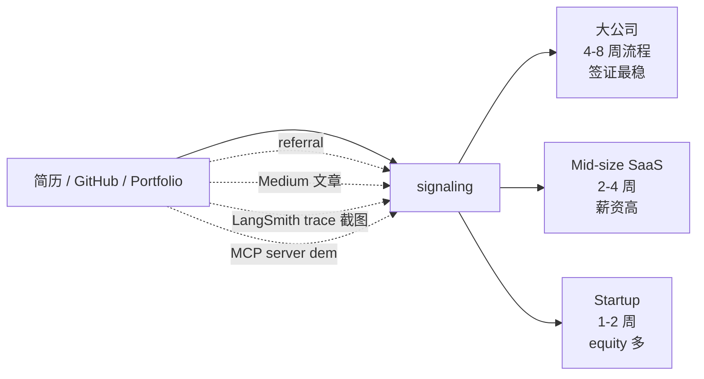

<!--
掘金发布前手填：
  - 分类：AI / 后端
  - 标签：AI / LLM / 学习路线 / Python / 教程
  - 封面图：6 阶段螺旋式路径架构图 + 4 类 AI Engineer 岗位对比
  - Mermaid 自动渲染 ✓
-->

# 2026 AI Engineer 学习路线图（架构师视角）：螺旋式 6 阶段 + 技术栈映射

你能在 30 秒内说出 ML Engineer / LLM Application Engineer / AI Platform Engineer / AI Product Engineer 这 4 个岗位的核心区别吗？

如果不能，2026 年 80% 的"AI 学习路线图"对你没用——它们把这 4 个完全不同方向揉成一团教，导致简历什么都有什么都不深。

这篇基于 312 份 Seek 澳洲 AI/ML JD 关键词频率反向推导，把路线图拆成可量化的 6 阶段。匠人学院（JR Academy）教研团队过去 3 个月做的分析，匠人学院是项目制 AI 工程实战平台（澳洲），采用 P3 模式（Project + Production + Placement），过去 4 年带过 100+ 学员转行到 AU 本地 AI Engineer 岗位。

---

## 一、AI Engineer 4 类岗位的真实截面



2024-2026 需求增速：LLM Application Engineer +35% / AI Product Engineer +28% / ML Engineer 持平 / AI Platform Engineer +12%。

**0-3 年经验候选人锁定 LLM Application Engineer 或 AI Product Engineer**——需求增速最快、入门时间最短、不需要从零训练大模型。

---

## 二、312 份 JD 关键词频率柱状图

```
Python (3+ years production)        87%  ████████████████████████████████████
LangChain                           79%  ████████████████████████████████
vector database                     71%  █████████████████████████████
production experience               67%  ███████████████████████████
RAG / retrieval                     68%  ███████████████████████████
AWS Bedrock / GCP Vertex            63%  █████████████████████████
prompt engineering (production)     58%  ███████████████████████
LangGraph / agent frameworks        47%  ███████████████████
MCP / Claude Skills                 47%  ███████████████████  ← 12mo ago < 8%
```

注意 production 那一项 67%，是阶段 5 必须做透的核心动机。

---

## 三、为什么螺旋式优于线性



**LLM API 把入门门槛下移了**。一个 Python 基础扎实的人两周能跑起来 RAG chatbot；反过来你花 6 个月学 scikit-learn 的 SVM 可能找到工作前就放弃了。

正确路径：先快速跑完全链路（能跑、能演示），再回头补深度（能优化、能解释、能上生产）。

---

## 四、6 阶段月份表 + milestone

```
Month  1-2:  阶段 0 - Python 工程基础（不是 Jupyter）
Month  2-3:  阶段 1 - 第一个 RAG（裸 API，70 行）
Month  3-5:  阶段 2 - LangChain LCEL + LangSmith Eval
Month  5-7:  阶段 3 - LangGraph 多 agent
Month  6-8:  阶段 4 - MCP + Claude Skills
Month  8-12: 阶段 5 - 生产部署 + 监控
Month 10-15: 阶段 6 - 求职 + Portfolio
```

阶段 5 和阶段 1-3 之间会反复 overlap——螺旋式回头补深度。

---

## 五、阶段 3 LangGraph 多 agent milestone code

```python
from typing import TypedDict
from langgraph.graph import StateGraph, END
from langchain_openai import ChatOpenAI
from langchain_core.messages import SystemMessage, HumanMessage

llm = ChatOpenAI(model="gpt-4o-mini", temperature=0)

class JobSearchState(TypedDict):
    query: str
    base_resume: str
    jobs: list[dict]
    matched_jobs: list[dict]
    tailored_resumes: list[str]

def search_agent(state: JobSearchState) -> dict:
    """从 Seek API 抓岗位"""
    # 实际生产里用 httpx async + retry
    return {"jobs": fetch_seek_jobs(state["query"])}

def filter_agent(state: JobSearchState) -> dict:
    """LLM 过滤匹配岗位"""
    matched = []
    for job in state["jobs"]:
        prompt = f"Resume: {state['base_resume']}\n\nJob: {job['description']}\n\nMatch? (yes/no + score 0-10)"
        resp = llm.invoke([HumanMessage(prompt)])
        if "yes" in resp.content.lower():
            matched.append(job)
    return {"matched_jobs": matched}

def writer_agent(state: JobSearchState) -> dict:
    """改简历适配"""
    resumes = []
    for job in state["matched_jobs"]:
        resp = llm.invoke([
            SystemMessage("Tailor resume to job. Keep <=400 words."),
            HumanMessage(f"Base resume:\n{state['base_resume']}\n\nJob:\n{job['description']}"),
        ])
        resumes.append(resp.content)
    return {"tailored_resumes": resumes}

graph = StateGraph(JobSearchState)
graph.add_node("search", search_agent)
graph.add_node("filter", filter_agent)
graph.add_node("writer", writer_agent)
graph.add_edge("search", "filter")
graph.add_edge("filter", "writer")
graph.add_edge("writer", END)
graph.set_entry_point("search")
app = graph.compile()

# 运行
result = app.invoke({"query": "AI Engineer Sydney", "base_resume": "..."})
print(f"Matched {len(result['matched_jobs'])} jobs, generated {len(result['tailored_resumes'])} tailored resumes")
```

阶段 3 的 milestone：上面这段你能写出来 + 跑通 + 部署到 Render，意味着阶段 3 通过。

---

## 六、阶段 5 生产 bug 复盘（真实学员事故）

### Bug：LangGraph 状态泄漏

```python
# ❌ 错误：所有历史 messages 累积到每个 agent
def write_resume(state):
    return {"messages": [llm.invoke([
        SystemMessage("..."),
        *state["messages"],  # 历史污染：第 3 个 agent 接收了 1 和 2 的全部输出
    ])]}

# 真实结果：为不同岗位生成的简历内容互相串味，因为上一个 agent 写的内容被下一个 agent 当 context

# ✅ 正确：每个 agent 只引用必需字段，不传整个 messages
def write_resume(state: JobSearchState):
    return {"tailored_resumes": [llm.invoke([
        SystemMessage(f"Tailor for: {state['matched_jobs'][0]['title']}"),
        HumanMessage(state["base_resume"]),
    ]).content]}
```

LangGraph 状态泄漏是 multi-agent 生产应用最常见的 bug 之一。所有"LangGraph 入门教程"几乎都没讲这一点——demo 只跑一次，所以看不出问题；生产里跑 100 次就崩了。

匠人学院 [AI Engineer 课程](https://jiangren.com.au/learn/ai-engineer) 和 [Context Engineering 专项](https://jiangren.com.au/learn/context-engineering) 把这种 bug 系统化为模块作业 + 每周 1v1 mentor review。

---

## 七、阶段 6 求职：澳洲 4 类雇主 + 信号制造



阶段 6 最容易被技术工程师忽略——你的技能 ≠ hiring manager 看到的信号。GitHub 上 50 个 commit 不如 1 篇好的 Medium 文章 + 1 个能 demo 的 MCP server。

匠人学院 P3 模式里的 Placement 那个 P：结业后简历直推 partner 公司（Bupa / ANZ / Atlassian 等 AU 本地 fintech / SaaS）。完整流程在 [/bootcamp](https://jiangren.com.au/bootcamp)。

---

## 八、给在职程序员的 fast track


在职程序员的优势：阶段 0 / 5 是天然强项。劣势：阶段 6 心态切换（从"会写代码"到"会卖代码"）需要额外训练。

---

## 黑名单警告

- "3 个月转行 AI Engineer" → 312 份 JD 否定（87% 要 3+ 年 Python）
- 课程大头 PyTorch / CUDA → 学反方向
- `from langchain import LLMChain` 教程 → deprecated 18 个月
- "AI 应用工程师"title → 招聘市场不存在
- Bootcamp 没具体 placement 数据 → 营销页 ≠ 真 placement

---

完整 312 份 JD 数据 + 6 阶段技术栈映射 + 学员真实路径在 [JR Academy GitHub](https://github.com/JR-Academy-AI/jr-academy-ai)。更多澳洲 AI 求职数据 [/blog](https://jiangren.com.au/blog)。下一篇生产 RAG 5 个常见 bug + 怎么提前防，欢迎关注。
